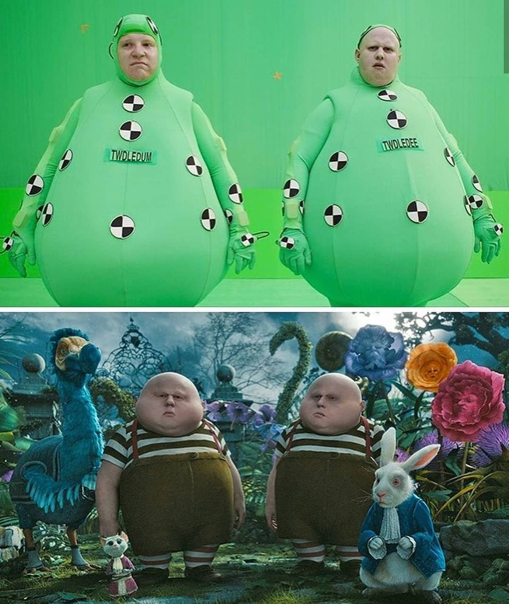
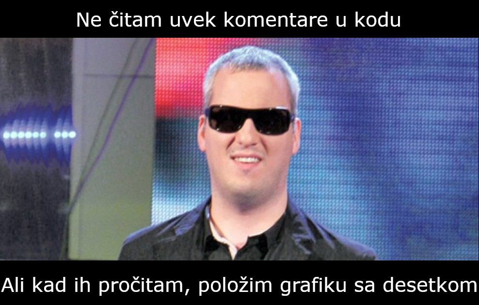

<!-- _backgroundColor: #222 -->
<!-- _color:           #eee -->

Računarska grafika
# O predmetu

---

# S kim imate posla

 

- Nastavnik: Marko Savić (marko.savic@dmi.uns.ac.rs, @marsavic)
- Saradnik: Luka Maslenjak (lukamaslenjak00@gmail.com, @lukam2082)

> 🤯 Kontakt: e-mail ili Discord. Ne Mudl! Za konsultacije se najavite.

---

# (Vrlo kratak) Pregled kursa

- Uvod: istorija, primene
- Svetlo i boja
- 2D rasterska grafika 
	- Obrada slike (filteri)
	- Rasterizacija (iscrtavanje jednostavnih objekata)
- 2D vektorska grafika
	- Parametrizovano crtanje
	- Animacija
- Proceduralno generisanje
- Krive
- Simulacija

---

# Potrebno predznanje

- Elementarno programiranje u Javi
- Matematika iz osnovne škole (i nešto malo iz srednje)
- Fizika (mehanika) iz osnovne škole
- Osnove linearne algebre i analitičke geometrije

---

# Polaganje

- Predispitne obaveze
	- Dva kolokvijuma (u sredini i na kraju semestra), po 30 bodova svaki.
		- Možete koristiti literaturu i internet, ali ne i komunicirati sa drugima!
	- **Dva** *popravna termina*
		- Prvi odmah nakon semestra, drugi kraju školske godine.
		- U svakom popravnom terminu možete popravljati svaki od kolokvijuma.
		- Popravni može biti i pokvarni! Prijavljivanje poništava prethodno osvojen broj bodova, računa se samo ono što je poslednje osvojeno.
- Da bi se položile predispitne obaveze potrebno je najmanje 30 bodova ukupno iz kolokvijuma.

> 🤯 Za desetku je potrebno da znate sve, uradite sve odlično, i da znanje umete kreativno da primenite! 💯

---

# Pripremite se za nastavu!

- Na vašim računarima treba da se nalazi:
	- JDK (Java Development Kit - najbolje da instalirate poslednju verziju)
	- IDE (IntelliJ IDEA, Eclipse, ...) - bilo koji IDE koji podržava verziju Jave koju koristite
- Svi kodove sa nastave će se objavljivati na Git-u (biće objašnjeno na vežbama)

> 🤯 Instalirajte i isprobajte softver što pre! Ne čekajte dan pred kolokvijum!

> 🤯 Možete koristiti svoje laptopove na predavanjima i vežbama.

- Registrujte se na [Mudl stranici kursa](https://moodle.pmf.uns.ac.rs/course/view.php?id=220).
	- Ime kursa: *Uvod u računarsku grafiku / Računarska grafika 1*
	- Pristupna lozinka: *fikagra*

- Pridružite se [Diskord serveru kursa](https://discord.gg/UrVFB4Bdtc).

---

# Materijali 📚

Na raspolaganju će vam biti:
* Svi slajdovi
* Sažete video lekcije*
* Lepo iskomentarisani kodovi sa predavanja i vežbi (Git)
	* > 🤯 Neophodno je da umete da čitate i razumete kod!
	* 

---

# Oznake u slajdovima

> 🤯 Saveti, napomene, i stvari na koje treba da obratite pažnju.

> 🍬 [Zanimljiv bonus materijal](https://www.youtube.com/watch?v=dQw4w9WgXcQ)

💻 `Fajl sa kodom koji treba pogledati`

