<!-- _backgroundColor: #222 -->
<!-- _color:           #eee -->
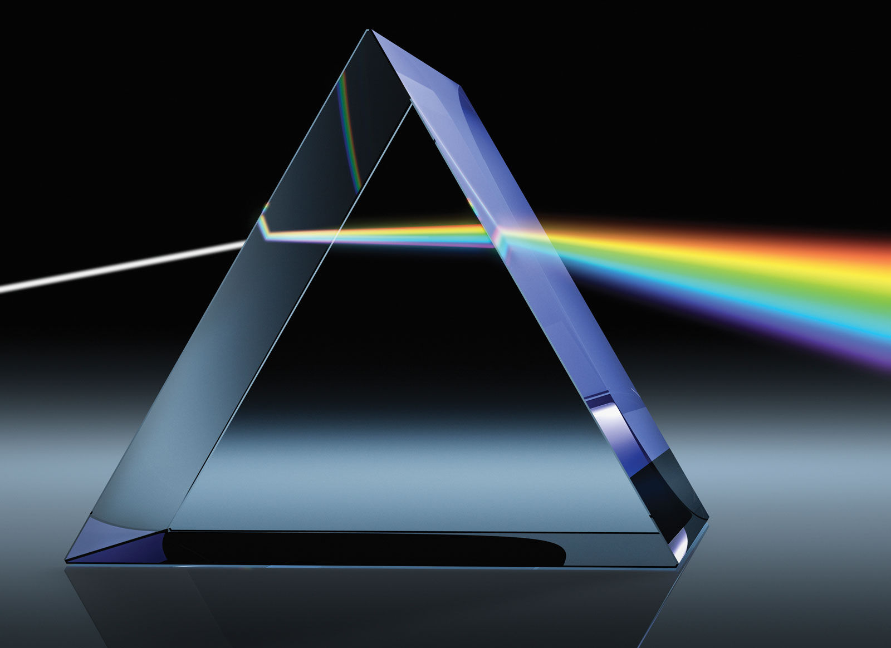

Računarska grafika
# Svetlo i boje

---

# Elektromagnetni talasi

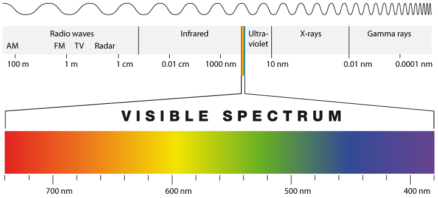

---

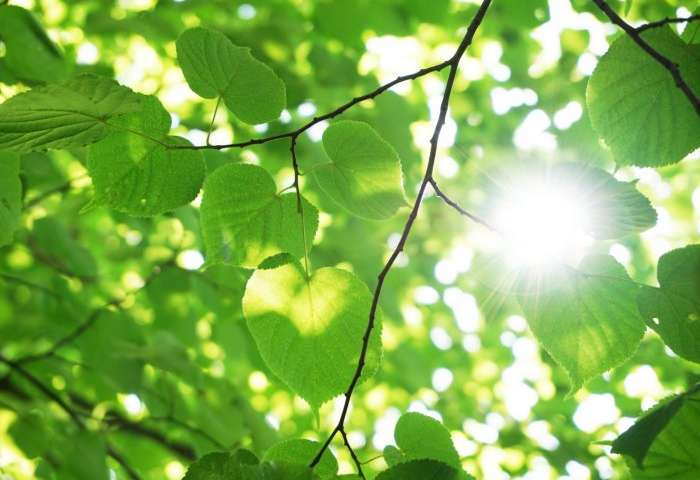
# Zašto su biljke zelene? 🍀
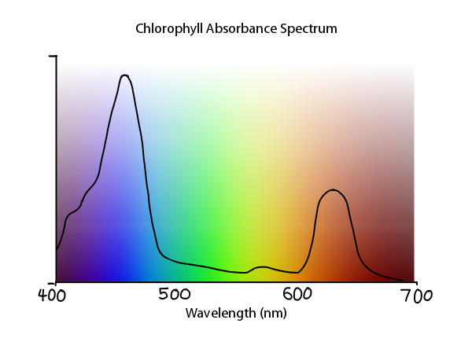

Zato što im je zelena boja najmanje korisna!

---

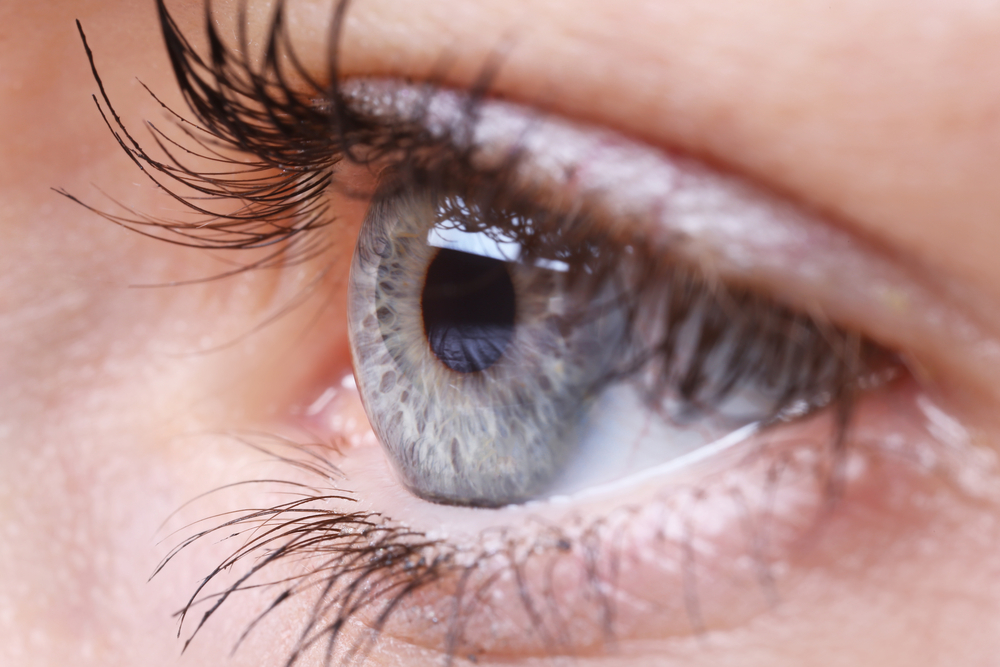
# Ljudsko oko 👁️
Dve vrste fotoreceptorskih ćelija u ljudskom oku:
- Štapići - izuzetno osetljivi i na slabo svetlo
- Čepići - odgovorni za percepciju boja
    - Tri vrste (🔵, 🟢, 🔴)

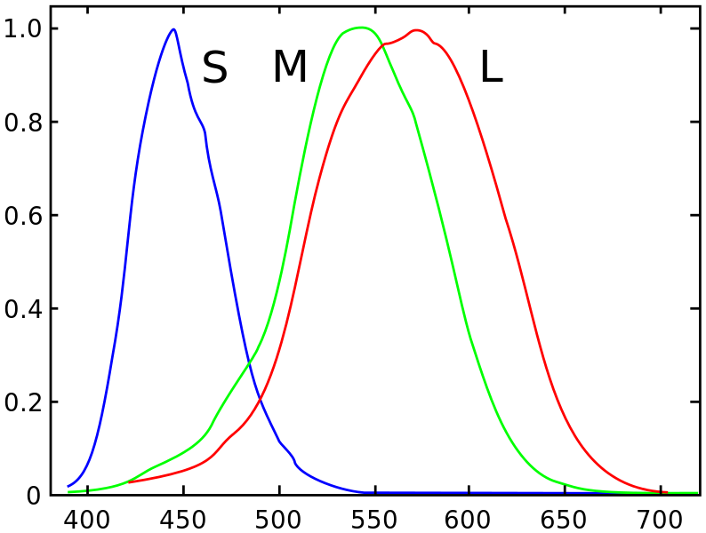

---

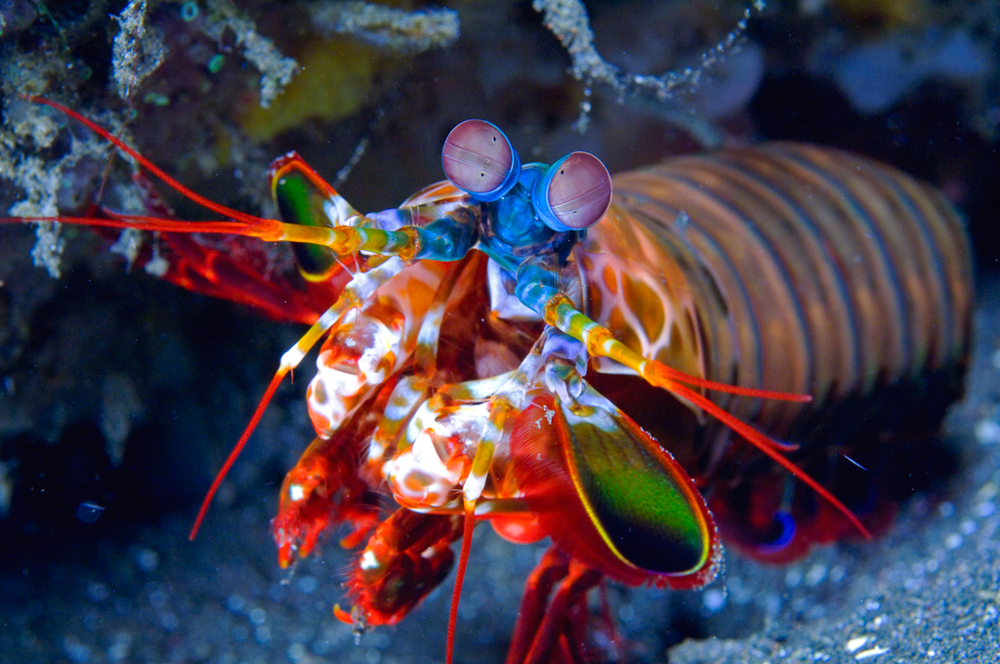

# Čepići

| Životinja     | Vrsta čepića |   |
|:--------------|:------------:|---|
| Pas           |  2 | 🔵🟢 |
| Čovek         |  3 | 🔵🟢🔴 |
| Leptir        |  5 | 🔵🟢🔴❔❔ |
| Mantis shrimp | 16 | 🔵🟢🔴❔❔❔❔❔❔❔❔❔❔❔❔❔ |

> 🍬 [The Oatmeal - Mantis Shrimp](https://theoatmeal.com/comics/mantis_shrimp)
<!-- 🍬 [Ze Frank - True Facts...](https://www.youtube.com/watch?v=F5FEj9U-CJM) -->

---

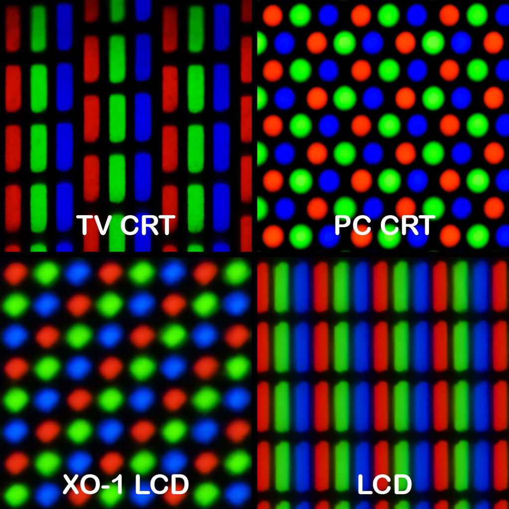
# Ekrani 🖥️
- Pravljeni su za čoveka! 😮
- Sastoje se od piksela
- Svaki piksel se sastoji od 3 vrste potpiksela (R, G, B).

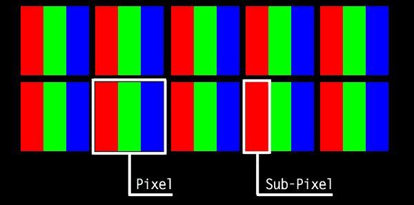

---

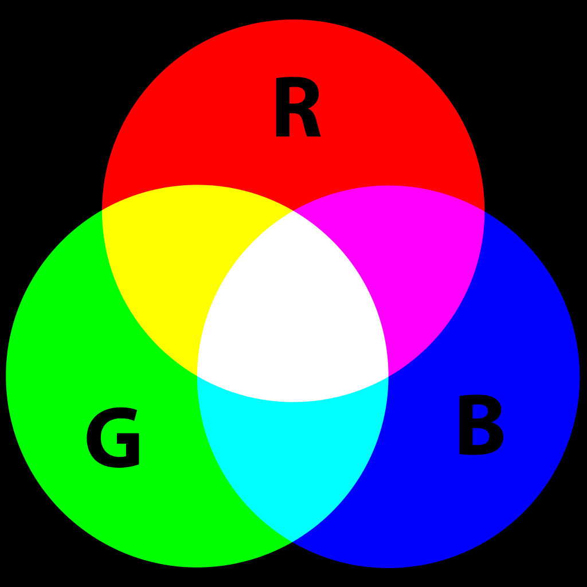
# RGB model boja
(Red, Green, Blue)

- Svaka boja je opisana sa tri komponente
- Vrednosti komponenti su brojevi koji označavaju koliko je komponenta prisutna u boji.
- Često su iz intervala 0-255 (8-bita po komponenti), ili realani brojevi između 0 i 1.
- RGB je aditivan model (na crnu osnovu dodajemo komponente).

---

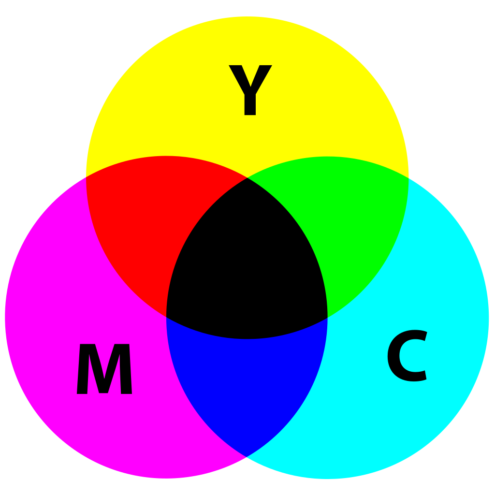
# CMY model boja
(Cyan, Magenta, Yellow)

- Subtraktivni model (od bele osnove oduzimamo komponente)
- Koristi se za štampanje (papir je beo, a mastilo filtrira boju koja dolazi od papira)

---

# HSB (HSV) model boja
(Hue, Saturation, Brightness / Value)

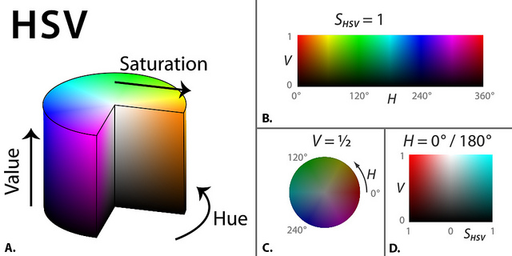

---

## Odabir boje koristeći HSB model (Paint i Photoshop)
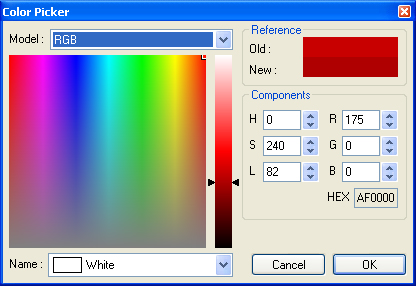 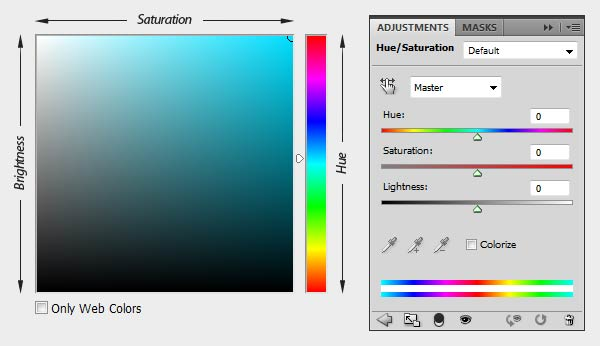

---

<!-- _backgroundColor: #6195ED -->
<!-- _color:           #fff -->

# Test!
## R, G, B = ?, ?, ?
## H, S, B = ?, ?, ?
## ...

---

<!-- _backgroundColor: #6195ED -->
<!-- _color:           #fff -->

# Test!
## R, G, B = 97, 149, 237
## H, S, B = 218°, 0.59, 0.93
## Cornflower Blue

---

<!-- _backgroundColor: #CCFF00 -->
<!-- _color:           #111 -->

# Test!
## R, G, B = ?, ?, ?
## H, S, B = ?, ?, ?
## ...

---

<!-- _backgroundColor: #CCFF00 -->
<!-- _color:           #111 -->

# Test!
## R, G, B = 204, 255, 0
## H, S, B = 72°, 1.00, 1.00
## Electric Lime

---

<!-- _backgroundColor: #800B47 -->
<!-- _color:           #fff -->

# Test!
## R, G, B = ?, ?, ?
## H, S, B = ?, ?, ?
## ...

---

<!-- _backgroundColor: #800B47 -->
<!-- _color:           #fff -->

# Test!
## R, G, B = 128, 11, 71
## H, S, B = 329°, 0.91, 0.50
## Rose Bud Cherry

---

🍬 [https://xkcd.com/1882/](https://xkcd.com/1882/)
🍬 [RGB Rush](https://store.steampowered.com/app/1952760/RGB_Rush/)
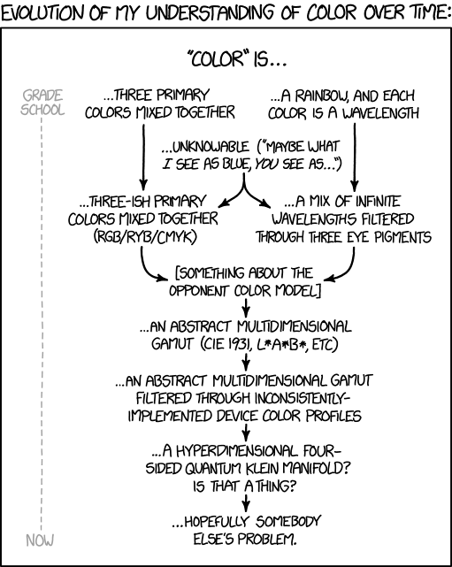
