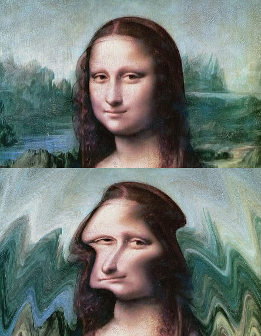
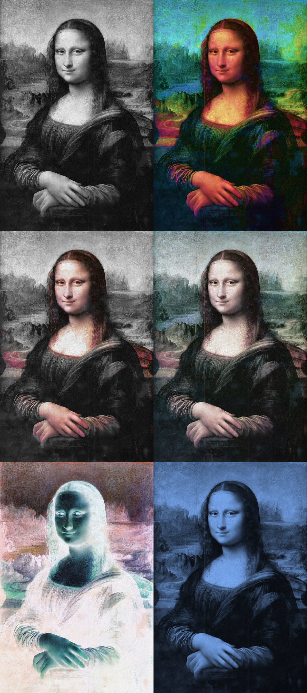
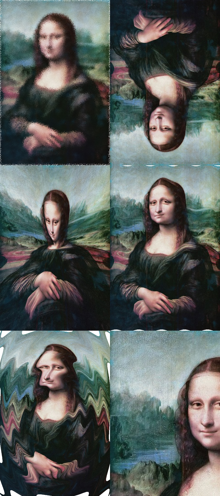
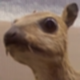
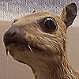
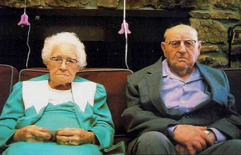
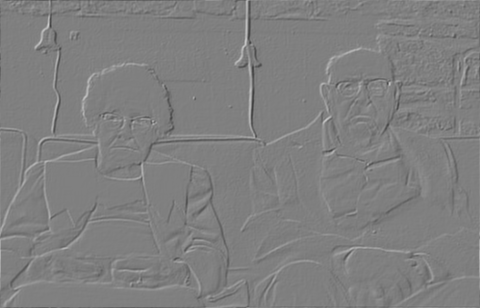

<style>
  img[alt~='center'] {
    display: block;
    margin-left: auto;
    margin-right: auto;
  }
</style>

<!-- _backgroundColor: #222 -->
<!-- _color:           #eee -->


Računarska grafika
# Obrada slike

---

# Obrada slike (Image processing)

Transformacija slike primenom zadatog algoritma.

$RezultujucaSlika = f(OriginalnaSlika)$

Tipovi filtera:
- Color
- Displacement
- Convolution
- Fourier domain
- ...

💻 `filters.Filter`

---

# Color filter


Nezavisno postavlja boju svakog piksela samo na osnovu boje originalnog piksela.

Definisan funkcijom koja transformiše jednu boju u drugu.

```text
for-each pixel
  output_color = f(input_color)
```

**Primeri:**
Grayscale, Saturate,
Accent, Desaturate,
Invert, Colorize

> 🤯 Da li je _auto contrast_ color filter?
<!-- TODO: Slajd o auto contrast filteru--->

💻 `ColorFilter`, `filters.color.*`

---

# Displacement filter


"Premešta" piksele. Definisan je funkcijom koja za svaki položaj na rezultujućoj slici vraća odakle treba uzeti piksel sa originalne slike.

```text
for-each pixel
  input_position = f(output_position)
```

**Primeri:**
Jitter, FlipVertical,
Lens, Wave,
Swirl, Zoom
 
💻 `DisplacementFilter`, `filters.displacement.*`

---

# Padding

Šta raditi kad filteri žele da koriste originalnu sliku van njenog okvira? (Dešava se u displacement i convolution filterima)
- **Fiksna boja** - Smatramo da su svi pikseli van slike neke određene boje (npr. svi transparentni ili svi crni).
- **Proširivanje slike** - Svaki piksel van slike smatramo da je boje kao njemu najbliži piksel na obodu slike.
- **Ogledalo** - Slika se reflektuje oko svojih ivica.
- **Popločavaje** - Smatramo da je cela ravan popločana kopijama slike.
- **Isecanje** - Odbacujemo deo rezultujuće slike za koji nam trebaju pikseli van originalne slike.

---

# Convolution filteri

$$ g = \omega * f $$

- Operacija $*$ se naziva **_konvolucija_**.
- $f$ - originalna slika - $f(x,y)$ je piksel na poziciji $(x,y)$ originalne slike.
- $g$ - rezultujuća slika - $g(x,y)$ je piksel na poziciji $(x,y)$ rezultujuće slike.
- $\omega$ - **_Kernel_** - matrica dimenzija $(2a+1) \times (2b+1)$, sa pozicijom $(0,0)$ u centru.

$$ g(x,y) = \sum _{s=-a}^{a}{\sum _{t=-b}^{b}{\omega (s,t)f(x-s,y-t)}} $$

💻 `ConvolutionFilter`

---

# Convolution filteri - Identity

$\begin{bmatrix}0&0&0\\0&1&0\\0&0&0\end{bmatrix}$

 

---

# Convolution filteri - Box blur

$\begin{bmatrix}1/9&1/9&1/9\\1/9&1/9&1/9\\1/9&1/9&1/9\end{bmatrix}$

 

---

# Convolution filteri - Sharpen

$\begin{bmatrix}0&\ \ -1&0\\-1&5&-1\\0&\ \ -1&0\end{bmatrix}$

 

---

# Convolution filteri - Edge detect

$\begin{bmatrix}-1&\ \ -1&-1\\-1&8&-1\\-1&\ \ -1&-1\end{bmatrix}$

 

---

# Sobel operator

Služi za aproksimiranje gradijenta u svakoj tački (korisno za detekciju ivica).

Gradijent pokazuje u kom smeru raste vrednost i kojom brzinom.

Vektor $G_{x,y} = (G_x, G_y)$ je aproksimacija **_gradijenta_** u tački $(x,y)$.

$$
G_x = {\begin{bmatrix}-1&0&+1\\-2&0&+2\\-1&0&+1\end{bmatrix}} * A
\quad \quad \quad
G_y = {\begin{bmatrix}-1&-2&-1\\0&0&0\\+1&+2&+1\end{bmatrix}} * A
$$

Svaki od Sobel kernela je proizvod kernela koji "uprosečuje" i kernela koji "diferencira".

$$
G_x = {\begin{bmatrix}1\\2\\1\end{bmatrix}} * \left({\begin{bmatrix}-1&0&+1\end{bmatrix}} * A \right)
\quad \quad \quad
G_y = {\begin{bmatrix}-1\\0\\+1\end{bmatrix}} * \left({\begin{bmatrix}1&2&1\end{bmatrix}} * A \right)
$$

---

# Prikaz gradijenta

- Uzimanjem magnitude gradijenta, $\|G_{x,y}\|$, formiramo sliku sa obeleženim ivicama.

- Reljefnu sliku formiramo tako što svaki piksel postavimo na vrednost skalarnog proizvoda gradijenta i nekog zamišljenog pravca svetla, $G_{x,y} \cdot L$.






💻 `DemoSobel`, `Sobel`
