<style>
  img[alt~='center'] {
    display: block;
    margin-left: auto;
    margin-right: auto;
  }
</style>

<!-- _backgroundColor: #222 -->
<!-- _color:           #eee -->
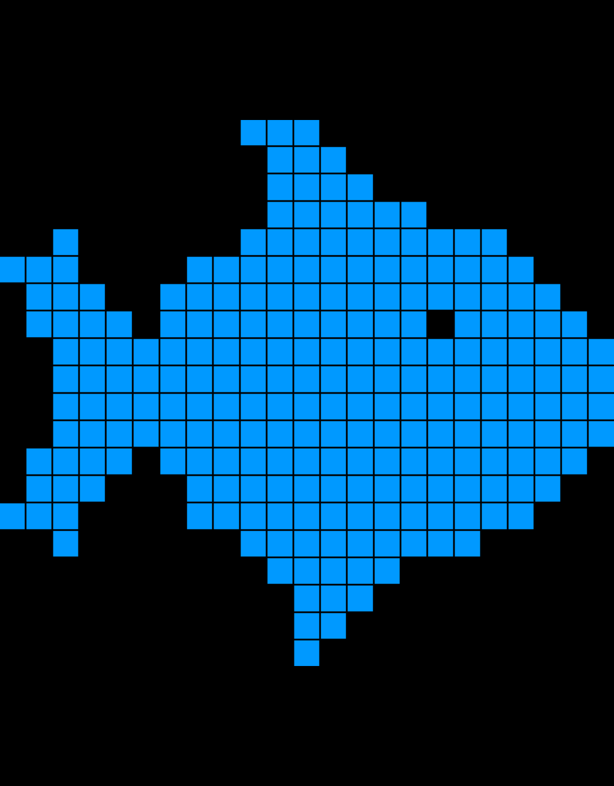

Računarska grafika
# Rasterska grafika

---

# Iscrtavanje scene (renderovanje)

Scena - Skup geometrijskih objekata i njihovih osobina koje želimo iscrtati.

Dva osnovna pristupa iscrtavanju scene:

- **Image-order**
    - ```for-each pixel { ... }``` (Iterira po pikselima slike koju želimo proizvesti.)
    - Za svaki piksel pronalazi kom objektu pripada, izračunava kako ta tačka na objektu izgleda i to smešta u sliku.
    - Simuliramo kretanje zraka svetlosti (_ray tracing_).
- **Object-order**
    - ```for-each object { ... }``` (Iterira po objektima scene koje želimo prikazati.)
    - Za svaki objekat izračunava njegov položaj na slici i ispunjava piksele koji mu pripadaju - **rasterizacija** + **shading**

---

# Rasterizacija i shading

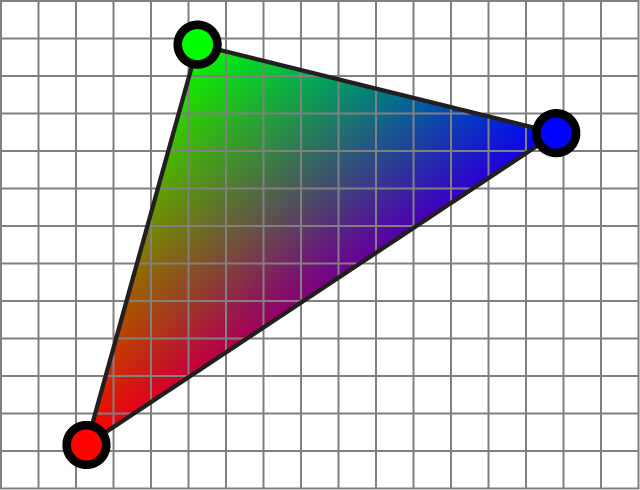 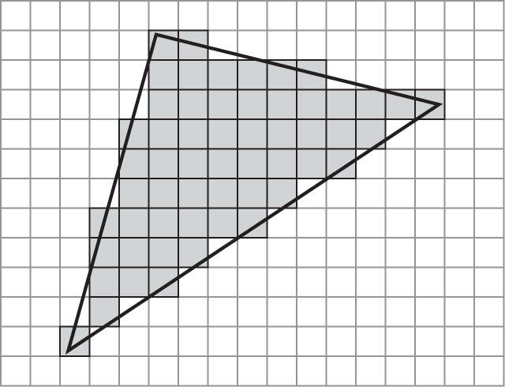 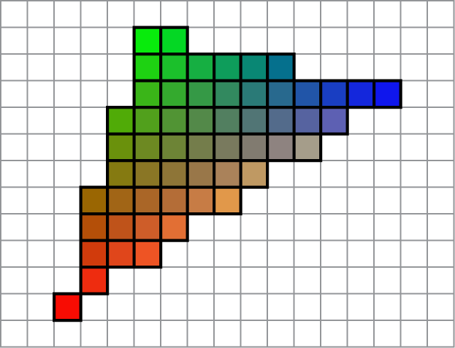

**Rasterizacija** = Određivanje piksela koji pripadaju geometrijskom objektu.

**Shading** = Određivanje boje tih piksela.

Elementarni geometrijski objekat, _primitiv_,  (╱, ⚫,⬛) → grupa piksela

---

# Rasterizacija triangulacije

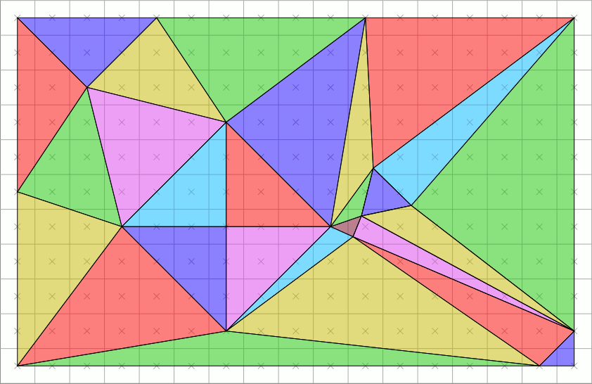
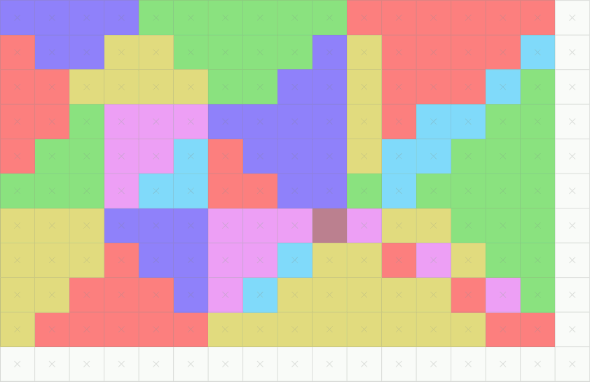

__Ciljevi__:
- Nema rupa između trouglova.
- Piksel pripada najviše jednom trouglu.

__*Gore-levo* pravilo__. Piksel je u trouglu akko:
- njegov centar je u unutrašnjosti trougla, ili
- njegov centar je na stranici trougla koja je
    - horizontalna i gore, ili
    - sa leve strane trougla.

---

# Rasterizacija duži

- Matematička linija nema debljinu i sastoji se od beskonačno mnogo tačaka.
- Pikseli su [mali kvadrati](http://alvyray.com/Memos/CG/Microsoft/6_pixel.pdf) i ima ih konačno mnogo.
- Koje piksele izabrati da prikažu liniju?


## Brezenhamov algoritam (1965)

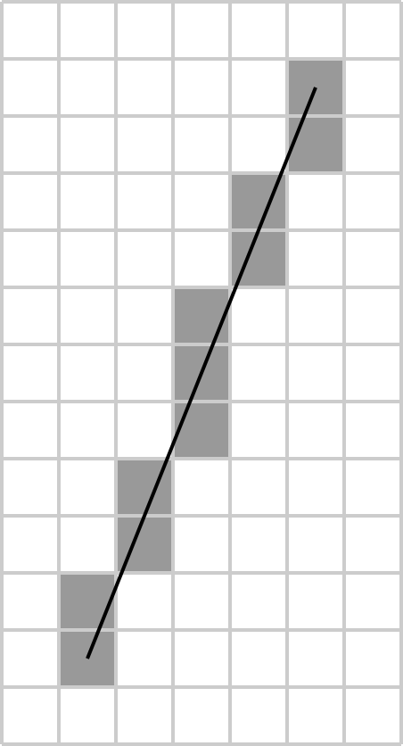

😊 Izuzetno brz! (Jednostavan, koristi celobrojnu aritmetiku.)
🙂 Određuje piksele koji optimalno aproksimiraju zadatu duž.

😡 Dozvoljene su samo celobrojne koordinate krajeva duži.
😡 Izgleda ružno - stepeničasto (pikseli samo "crni" ili "beli").

---

# Brezenhamov algoritam

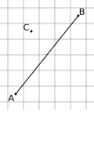

Za tačke $A = (A_x, A_y)$, $B = (B_x, B_y)$, definišemo _grešku_ tačke $C = (C_x, C_y)$
$$err(C) := \overrightarrow{AB} \times \overrightarrow{AC}$$
$$err(C) = (B_x-A_x)(C_y-A_y)-(C_x-A_x)(B_y-A_y)$$

$err(C) = 0 \quad \implies \quad$ $C$ je na $AB$
$err(C) > 0 \quad \implies \quad$ $C$ je sa leve strane $AB$
$err(C) < 0 \quad \implies \quad$ $C$ je sa desne strane $AB$

$|err(C)|$ proporcionalno udaljenosti $C$ od $AB$.

$$D_x := B_x - A_x \qquad D_y := B_y - A_y$$
$$err(C+(1,0)) - err(C) = -(B_y - A_y) = -D_y$$
$$err(C+(0,1)) - err(C) = +(B_x - A_x) = +D_x$$

---

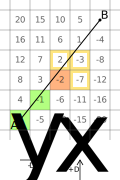

Korak desno: $err$ -= $D_y$.
Korak gore: $err$ += $D_x$.

Na slici su prikazane $err$ vrednosti piksela.

Dalje smatramo da je $B$ gore desno od $A$.

**Algoritam:**
- Krećemo od $C = A$.
- U svakom koraku $C$ prelazi na onaj od tri susedna piksela koji ima najmanju apsolutnu vrednost greške.
- Zaustavljamo se kad bude $C = B$.

---


**Implementacija:**
- U toku izvršavanja u promenljivoj `err` pamtimo $err(C+(1,1))$.
Početna vrednost za `err`, kada je $C = A$:
$err = err(A+(1,1)) = D_x - D_y$
- Povećavamo y (idemo gore ili gore-desno) ako
$|err(C+(1,1))| < |err(C+(1,0))|$
$\Leftrightarrow |err| < |err - D_x|$
$\Leftrightarrow 2 err < D_x$
- Povećavamo x (idemo desno ili gore-desno) ako
$|err(C+(1,1))| < |err(C+(0,1))|$
$\Leftrightarrow |err| < |err + D_y|$
$\Leftrightarrow 2 err > -D_y$


---

💻 `LineDrawing.drawLineBresenham`

```java
    void drawLineBresenham(PixelWriter pw, int ax, int ay, int bx, int by) {
        int dx = Math.abs(bx - ax),   dy = Math.abs(by - ay);
        int sx = ax < bx ? 1 : -1 ,   sy = ay < by ? 1 : -1;
        int cx = ax               ,   cy = ay;
        int err = dx - dy;		
        while (cx != bx || cy != by) {
            pw.setColor(cx, cy, Color.WHITE);
            int err2 = 2 * err;
            if (err2 > -dy) {
                cx += sx;
                err -= dy;
            }			
            if (err2 < dx) {
                cy += sy;
                err += dx;
            }
        }
        pw.setColor(cx, cy, Color.WHITE);
    }
```

---

# Rasterizacija duži

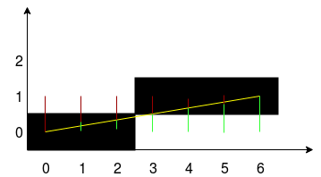
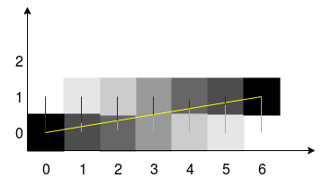

## Xiaolin Wu algoritam

Pikseli mogu imati bilo koju nijansu (providnost). Nijansa zavisi od toga "koliko je linija blizu centra piksela".

🙂 Brz, ali sporiji od Brezenhamovog algoritma.
😊 Perceptualno prijatniji od Brezenhama.
🙂 Dozvoljava realne koordinate krajeva duži

> Na slici gore: Brezenham
> Na slici dole: Xiaolin Wu

---

# Aliasing i Anti-aliasing

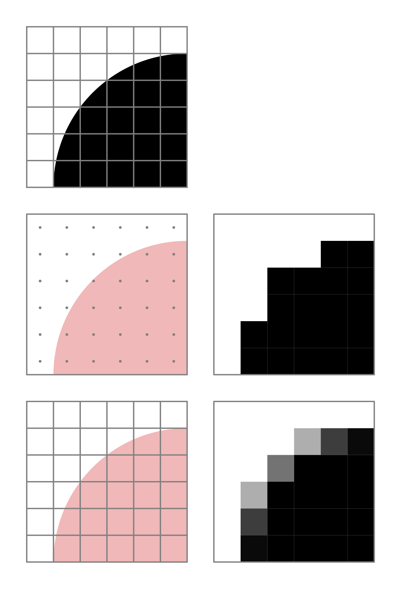

**Aliasing** - Pojava "testerastih" efekata.

**Anti-aliasing** - Menjanje vrednosti piksela kako bi se vizuelno ublažio efekat aliasinga.

---

# Antialiasing


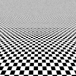
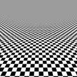


- **Pre-filtering (analitički)** - Računa koliki deo piksela je zauzet objektom koji se iscrtava. Precizno, ali sporo i moguće samo u jednostavnim slučajevima.

- **Post-filtering (super-sampling)** - Pravimo sliku n puta veće rezolucije, pa je smanjujemo na željenu veličinu. Svaki piksel željene slike se računa kao prosek odgovarajućih piksela veće slike.

💻 `Antialiasing`
