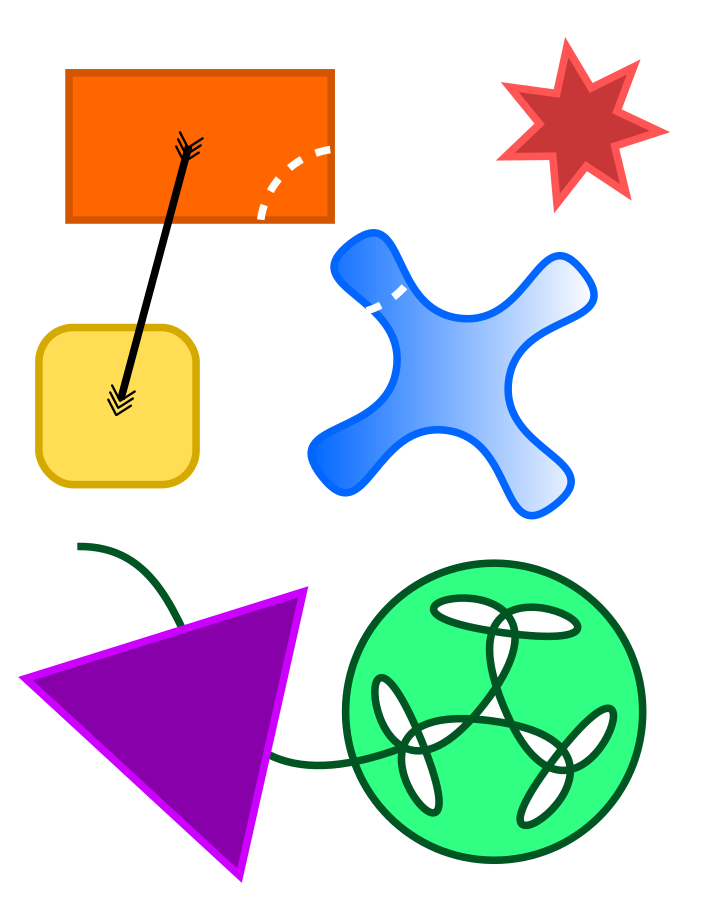
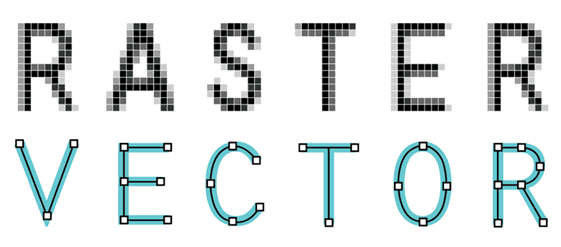
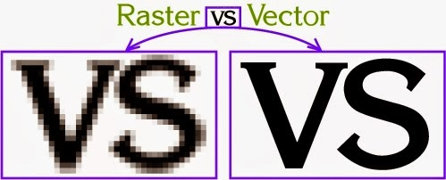
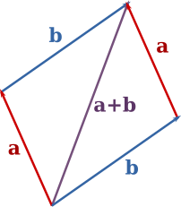

<style>
  img[alt~='center'] {
    display: block;
    margin-left: auto;
    margin-right: auto;
  }
</style>

<!-- _backgroundColor: #222 -->
<!-- _color:           #eee -->


Računarska grafika
# Vektorska grafika

---

# Raster vs Vector

💻 `RasterVsVector`




#### Rasterska grafika
- Sliku čini matrica piksela
- Memorija ~ veličina matrice
- Obrada kvari kvalitet
- Primene: fotografija

#### Vektorska grafika
- Sliku čine objekti opisani geometrijski
- Memorija ~ broj objekata
- Obrada očuvava kvalitet
- Primene: dizajn

---

# Klasa `Vector`



Immutable klasa koja predstavlja 2D vektor

|||
|-|-|
|`new Vector(x, y)`| Kreira vektor (x, y) |
|`Vector.ZERO`| Vektor (0, 0) |
|`inverse()`| Inverzni vektor |
|`add(o)`| Sabira sa vektorom o |
|`sub(o)`| Oduzima vektor o |
|`mul(k)`| Skalira faktorom k |
|`norm()`| Norma (dužina) |

---

# Klasa `Vector`

|||
|-|-|
|`Vector.polar(r, phi)`| Kreira vektor sa polarnim koordinatama (r, phi) |
|`angle()`| Ugao između x-ose i vektora
|`rotate(phi)`| Rotira za ugao phi |
|`dot(o)`| Skalarni proizvod |
|`cross(o)`| Vektorski proizvod |
|`perp()`| Normalni vektor (u pozitivnom smeru) |
|...||

---

# Klasa `View`

- Koordinatni sistem:
  - (0, 0) je u centru, x raste na desno, y raste na gore.
  - Uglovi se mere u okretima (turns). 1 okret je 360°, rastu od pozitivnog dela x-ose u pozitivnom smeru (suprotno od kazaljke na satu).
- Dva tipa metoda za crtanje oblika:
  - `stroke...` - crtaju obod oblika.
  - `fill...` - ispunjavaju oblik.
- Oblik se crta unutar _axis-aligned_ pravougaonika zadatog u parametrima:
  - `...(Vector p, Vector d)` - Jedno teme u `p`, suprotno teme u `p`+`d`
  - `...Centered(Vector c, Vector r)` - Centar u `c`, radijus-vektor `r`.
- Stanje: {stroke boja, fill boja, debljina linije, transformacija, ...}

💻 `SmileyFace`


---

# Transformacije

**Transformacije:** funkcije nad vektorima
(ali ih možemo zamišljati i nad celim objektima ili celim prostorom)

**Primeri primene:**
2D: iscrtavanje definisanog objekta na drugom mestu i uz modifikacije.
3D: premeštanje kamere kojom se "snima" scena.

**Afine transformacije:** transformacije koje očuvavaju paralelnost pravih.
- To su: translacija, rotacija, skaliranje, osna simetrija, iskošavanje, projekcija (i bilo koja kombinacija prethodnih).
- Predstavljaju se matricama. Rezultat primene transformacije se dobija množenjem matrice i vektora.

> 🍬 [Matematika afinih transformacija](
https://people.dmi.uns.ac.rs/~marko.savic/teaching/rg1/resources/transformations.pdf)
(Linearne transformacije, afine transformacije, homogene koordinate, 3D)

---

# Klasa `Transformation`

Immutable klasa koja predstavlja afinu transformaciju.

Kreiranje transformacija

|||
|-|-|
|`new Transformation()`| Identičko preslikavanje |
|`Transformation.scaling(c)`| Skaliranje c puta |
|`Transformation.scaling(cx, cy)`| Skaliranje cx puta po x osi i cy puta po y osi |
|`Transformation.translation(v)`| Translacija za vektor v |
|`Transformation.rotation(phi)`| Rotacija za ugao phi |
|`Transformation.shearing(kx, ky)`| Iskošavanje |

---

Kombinovanje transformacija

Ako nad objektom koji predstavlja transformaciju pozovemo neki od sledećih metoda, onda dobijamo novu transformaciju koja predstavlja kombinaciju transformacija.

|||
|-|-|
|`scale(c)`| Skalira c puta |
|`scale(cx, cy)`| Skalira cx puta po x osi i cy puta po y osi |
|`translate(v)`| Translira za vektor v |
|`rotate(phi)`| Rotira za ugao phi |
|`shear(kx, ky)`| Iskošava |

Nadovezivanje proizvoljne dve transformacije: `t1.then(t2)` (prvo radimo `t1`, pa `t2`).

Redosled izvršavanja transformacija je bitan!

---

## Primer

Rotaciju oko tačke `p` za ugao `phi` dobijamo kombinacijom:
1) Translacija koja dovodi tačku `p` u koordinatni početak.
2) Rotacija za ugao `phi`.
3) Translaciju koja vraća koordinatni početak u tačku `p`.

```java
  Transformation t = new Transformation()
      .translate(p.inverse())
      .rotate(phi)
      .translate(p)
      ;
```

💻 `Transformations`

---

## Primena transformacije na vektore i klasu `View`

- Primenom transformacije na vektor `v` dobijamo novi vektor.
  ```
  Vector u = t.applyTo(v)
  ```
- Klasa `View` ima aktivnu transformaciju koju koristi za iscrtavanje svih objekata.
  - `view.setTransformation(t)` postavlja aktivnu transformaciju na `t`.
  - `view.addTransformation(t)` dodaje transformaciju `t` na aktivnu transformaciju.
  - Najčešća upotreba:
    ```java
    view.stateStore();
    view.setTransformation(t);
    // iscrtaj nesto...
    view.stateRestore()
    ```

💻 `SquishyFace`
