

<!-- _backgroundColor: #222 -->
<!-- _color:           #eee -->
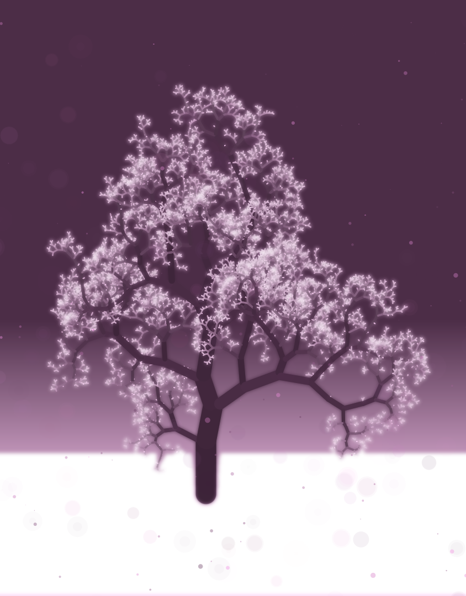

Računarska grafika
# Proceduralno generisanje

---

# Proceduralno generisanje

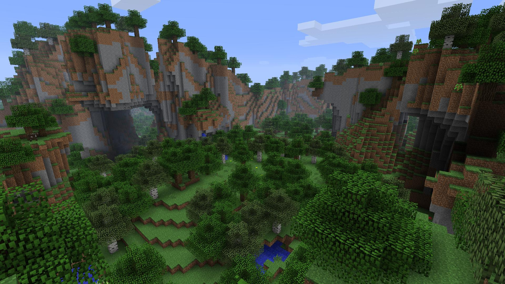

Generisanje sadržaja (slika, tekstura, animacija, modela, scena, mapa, ...) korišćenjem algoritama (nasuprot "ručnom" dizajniranju)

Alati:
- Matematičke funkcije
- Generatori slučajnih brojeva
- Fraktali
- Koherentni šum
- Verovatnosne distribucije
- ...

---

# Igranje sa matematičkim funkcijama

|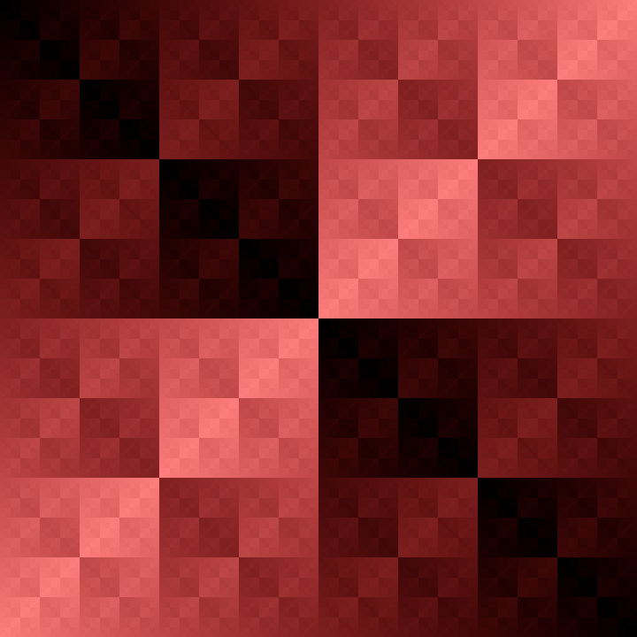|||
|-|-|-|
|$v = x \text{ xor } y$|$v = \cos x \cos y$|$v = \cos r \cos phi$|

---

# Samosličnost

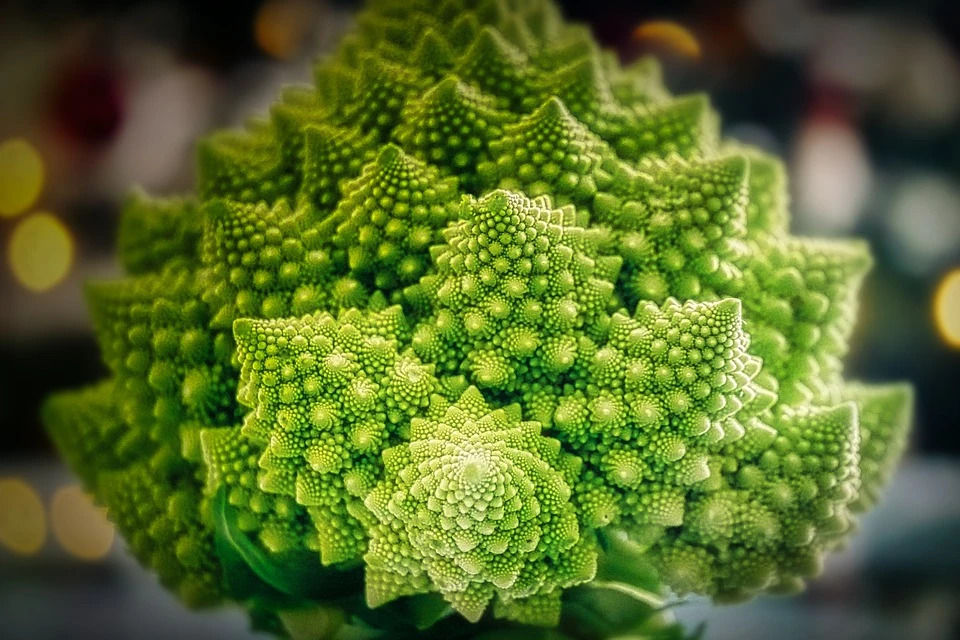 

 U prirodi često manji delovi nečega liče na celinu čiji su deo.
  - reljef, obale
  - drveće, paprat, karfiol
  - nautilus
  - munje
  - ...

---

# Fraktali

- Matematički definisani objekti čiji delovi liče na objekat u celini.

|💻 `IFSTree`|💻 `IFSPoly`|
|-|-|
||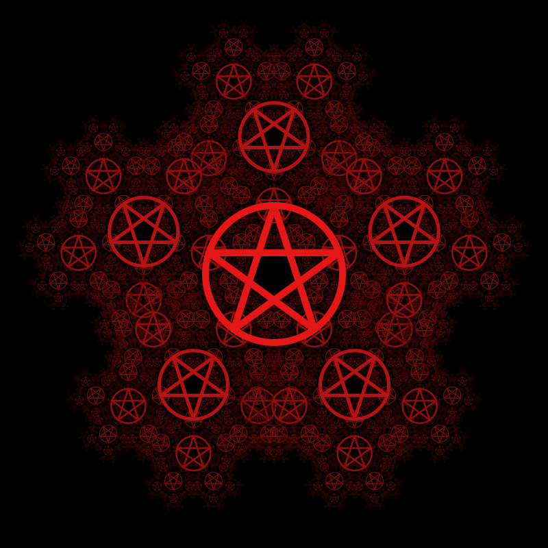|

---

# Koherentni šum

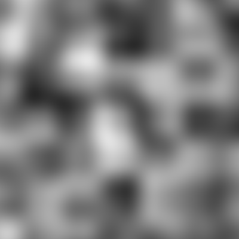

Funkcija koja tačke preslikava u vrednosti:
- razlika vrednosti je mala za bliske tačke
- vrednosti nisu u korelaciji ako su tačke daleko

## Perlin noise
Ken Perlin, 1983.
- Želeo je da grafiku učini da izgleda malo manje "mašinski", a više "organski".
- Za šta je dobio oskara!

---

# Koherentni šum

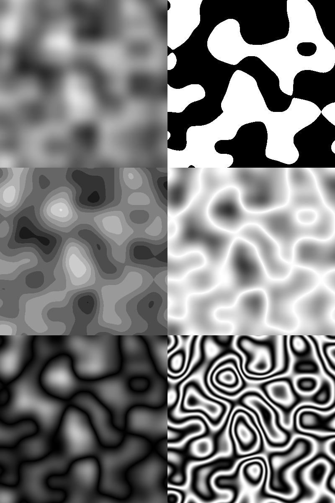

## Primena funkcija

💻 `PerlinNoiseDemo`

---

# Koherentni šum

## Kombinovanje

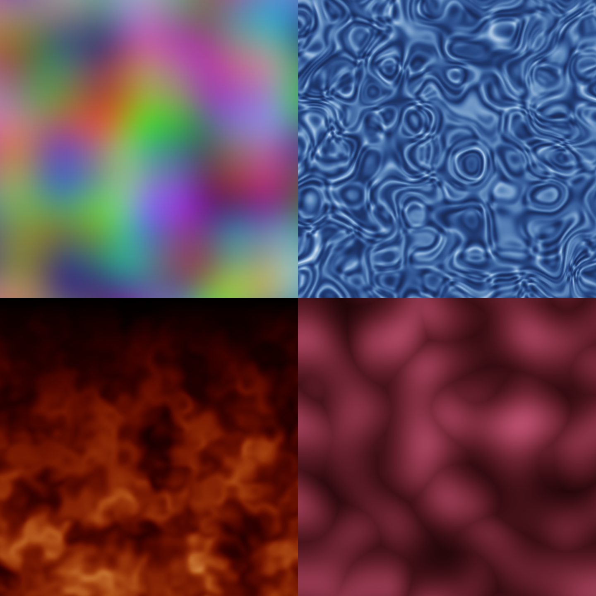

💻 `PixelFunctions`

---

# Frekvencija
- Učestalost "vizuelnih delova"
- Sitni delovi, mala rastojanja = velika frekvencija

# Amplituda
- Varijacija u intenzitetu između "vizuelnih delova"

---

## Fractal noise

Primena ideje samosličnosti na koherentni šum.

$$fractalNoise(p) = \sum_{k=1}^n amplitude_k \cdot noise_k(frequency_k \cdot p)$$

💻 `Terrain`

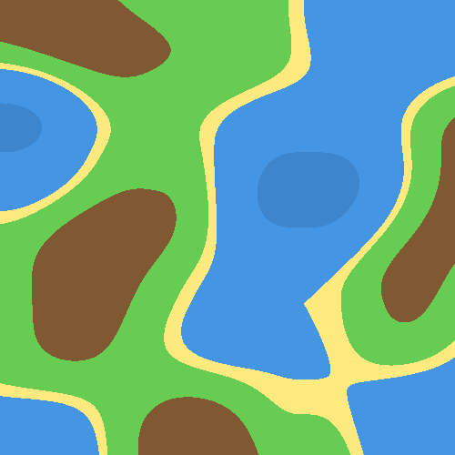 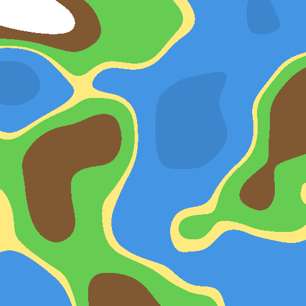 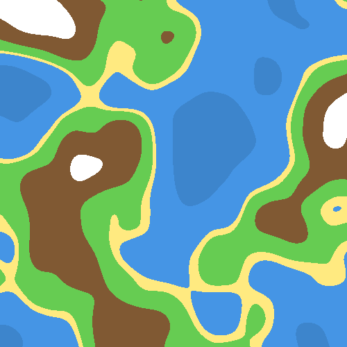 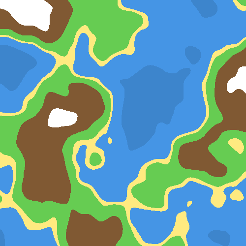 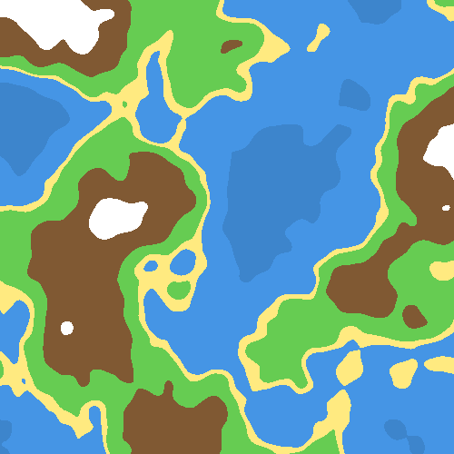

---

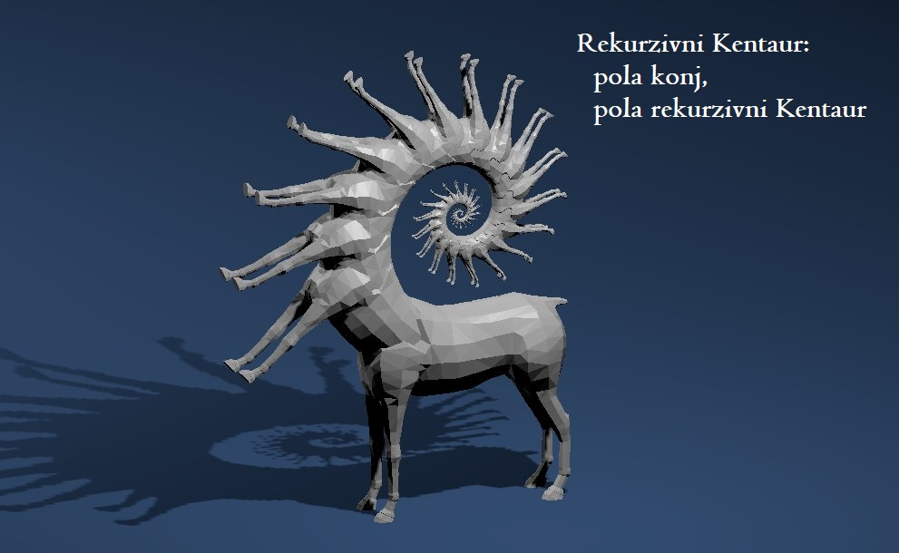
