<style>
  img[alt~='center'] {
    display: block;
    margin-left: auto;
    margin-right: auto;
  }
</style>

<!-- _backgroundColor: #222 -->
<!-- _color:           #eee -->
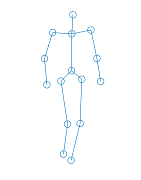

Računarska grafika
# Animacija

---

# Animacija


(latinski _animatio_: oživljavanje, davanje života)

Slika koja se menja kroz vreme
(funkcija koja preslikava vreme u sliku)

---

# Tehnike animacije
- **Frame-by-frame** - Svaki frejm je slika koja se individualno kreira (video, ručno kreirani crtani filmovi, pixel animation, ...).
- **Motion capture** - Animacija definisana eksternim podacima koji se dobijaju "snimanjem" aktera.
- **Keyframing** - Definišu se _ključni frejmovi_, dok sve momente između njih dobijamo interpolacijom ključnih frejmova.
- **Physics simulation** - Animacija stvarnih pojava simuliranjem fizičkih zakona (čvrsta tela, tkanina, voda, kosa, pesak, ...)
- **Procedural** - Animacija definisana procedurom (algoritmom), bez korišćenja eksternih podataka.


---


# Jednačine kretanja

---

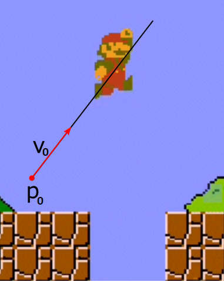
## Linearno kretanje

- $p_0$ - položaj u trenutku t = 0 (vektor)
- $v$ - konstantna brzina (vektor)

$p(t) = p_0 + vt$

```java
p = v0.mul(t).add(p0);
```


---

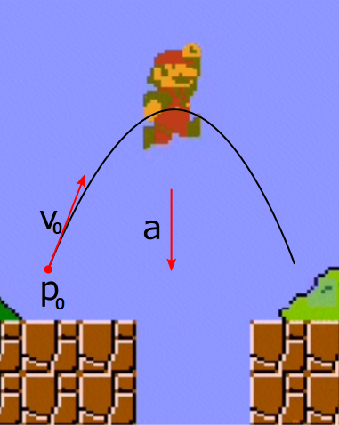

## Kretanje sa ubrzanjem

- $p_0$ - položaj u trenutku t = 0 (vektor)
- $v_0$ - brzina u trenutku t = 0 (vektor)
- $a$ - konstantno ubrzanje (vektor)

$p(t) = p_0 + v_0t + \frac{1}{2}at^2$
$v(t) = v_0 + at$

```java
p = a.mul(t*t/2).add(v0.mul(t)).add(p0);
v = a.mul(t).add(v0);
```

💻 `ProjectileMotion`

---

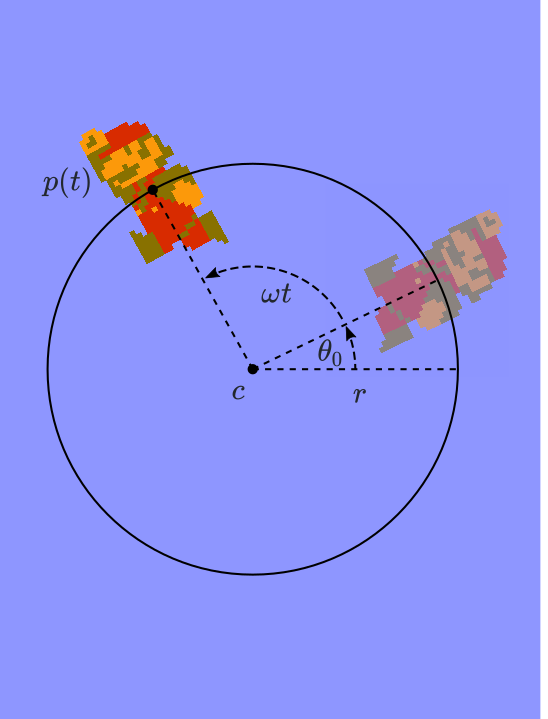

## Rotaciono kretanje

- $c$ - centar rotacije (vektor)
- $r$ - poluprečnik rotacije
- $\theta_0$ - ugao u trenutku t = 0
- $\omega$ - konstantna ugaona brzina

$\theta(t) = \theta_0 + \omega t$
$p(t) = c + r(\cos\theta(t), \sin\theta(t))$

## Oscilatorno kretanje

Projekcija kružnog kretanja na jednu dimenziju
$x(t) = c + r\sin\theta(t)$


---

## Rotaciono kretanje (kod)

Uglovi su dati u obrtima, pa koristimo funkcije `cosT` i `sinT` iz klase `Numeric`.

```java 
theta = theta0 + omega*t;
p = new Vector(Numeric.cosT(theta), Numeric.sinT(theta)).mul(r).add(c);
```

Ili, jednostavnije, koristimo funkciju `Vector.polar`.

```java
p = Vector.polar(r, theta).add(c);
```

💻 `RotatingRobot`


---


## Linearna interpolacija

- $p_0$ - pozicija u trenutku $t=0$
- $p_1$ - pozicija u trenutku $t=1$
- $t \in \mathbb R$ - t-parametar interpolacije

Krećemo se ravnomerno pravolinijski.
Pitanje: Gde se nalazimo u trenutku $t$?

$$p(t) = (1-t)p_0+tp_1$$
$$p(t) = p_0+t(p_1-p_0)$$

> 🤯 Primenljivo i korisno u svakom vektorskom prostoru! (funkcije, transformacije, boje, zvuci, ...)

---

## Linearna interpolacija (kod)


Interpolacija vektora (svi načini daju isti* rezultat):

`p = p0.mul(1-t).add(p1.mul(t));`
`p = p0.add(p1.sub(p0).mul(t));`
`p = Vector.lerp(p0, p1, t);`

Interpolacija boje:

`c = c0.interpolate(c1, t);`

💻 `AnimationCurves (index = 0)`

---

# Animacione krive

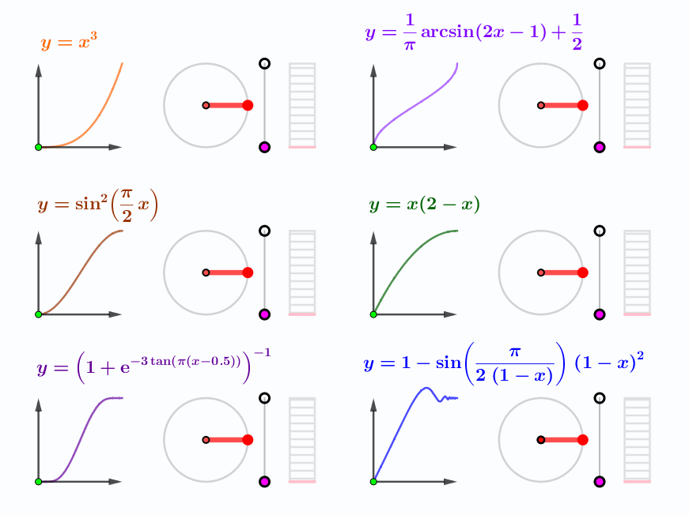

(_Easing_ funkcije)

`draw(t)` → `draw(f(t))`

Neprekidna funkcija,
$f : [0,1] \rightarrow [0,1]$,
$f(0) = 0, \quad f(1) = 1$
(Mogući su izuzeci)

Modifikuju brzinu interpolacije radi:
- Ublažavanja početka (_ease in_)
- Ublažavanja kraja (_ease out_)
- Ublažavanja i početka i kraja (_ease in out_)
- Efekata (_back, bounce, elastic, ..._)


---

# Animacione krive

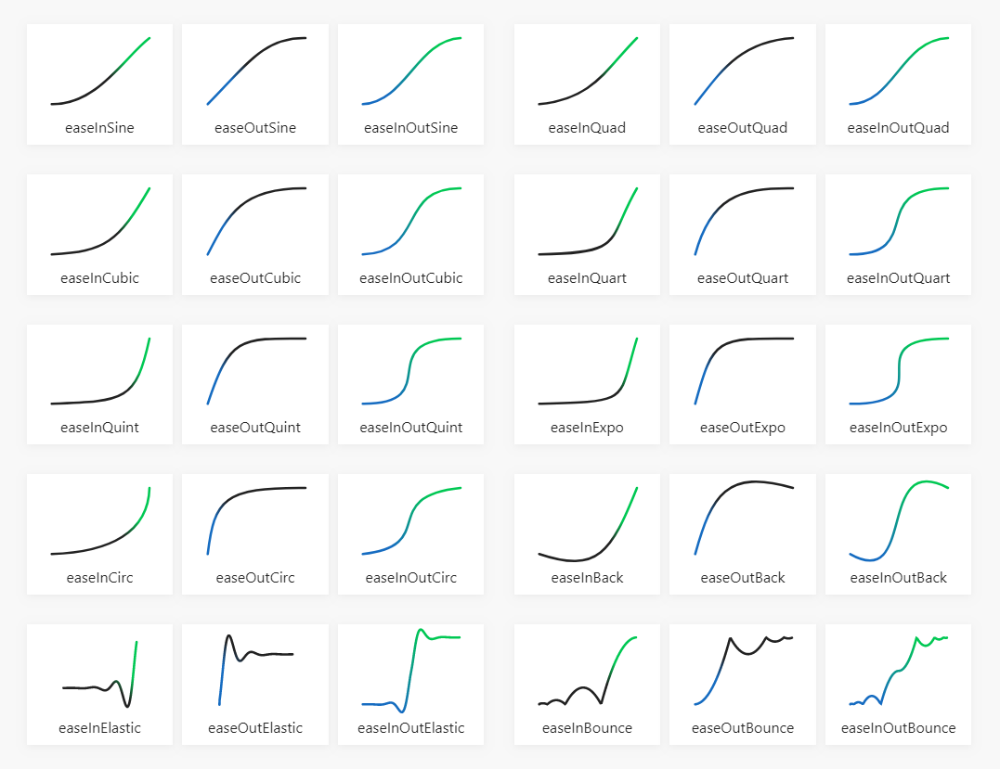

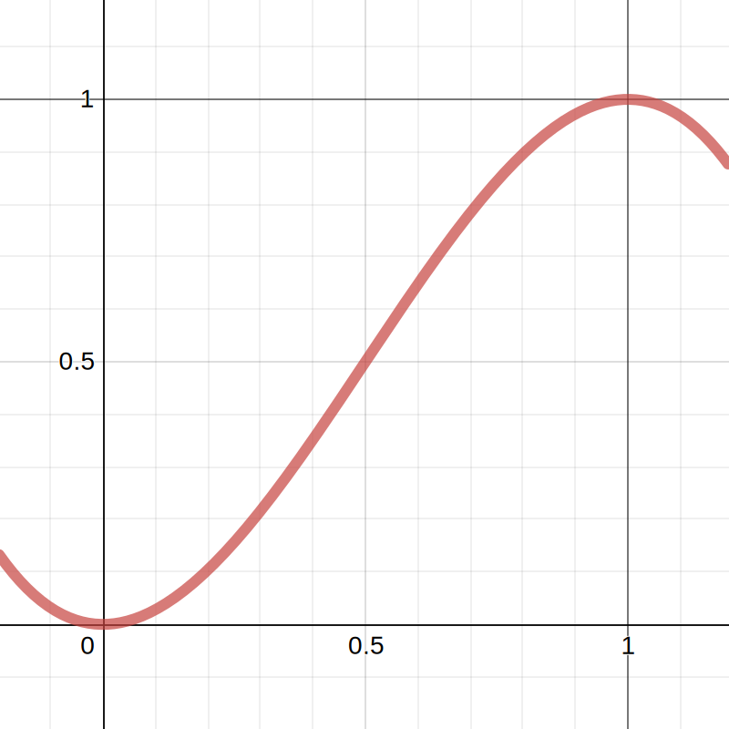

Smoothstep: $3x^2-2x^3$
Smootherstep: $6x^5-15x^4+10x^3$

https://easings.net
https://www.geogebra.org/m/kvy5zksn

💻 `AnimationCurves`

---

# Keyframing

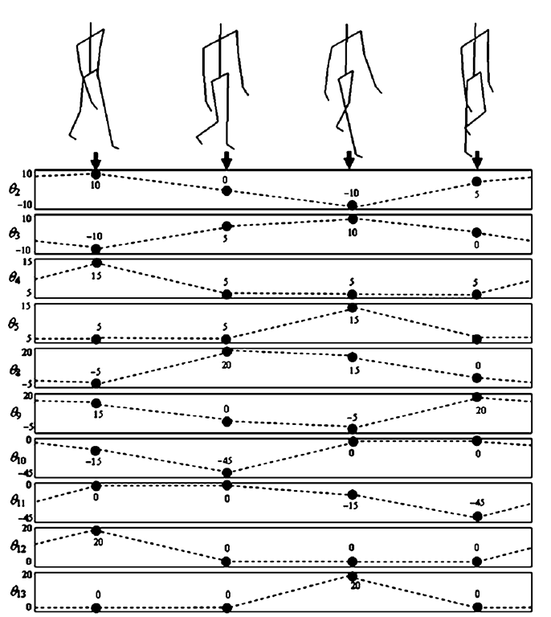

- Definišemo parametre scene samo u _ključnim_ trenucima (_keyframes_).
- Parametre u proizvoljnom trenutku dobijamo interpolacijom parametara iz okolnih keyframe-ova.

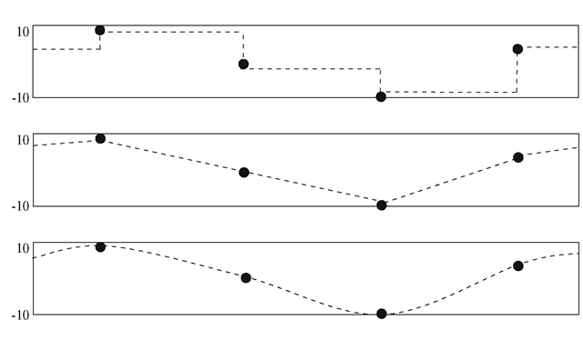

💻 `BoxAndBall`

---

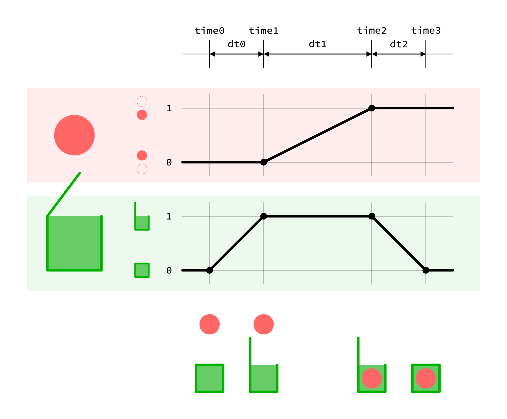

---

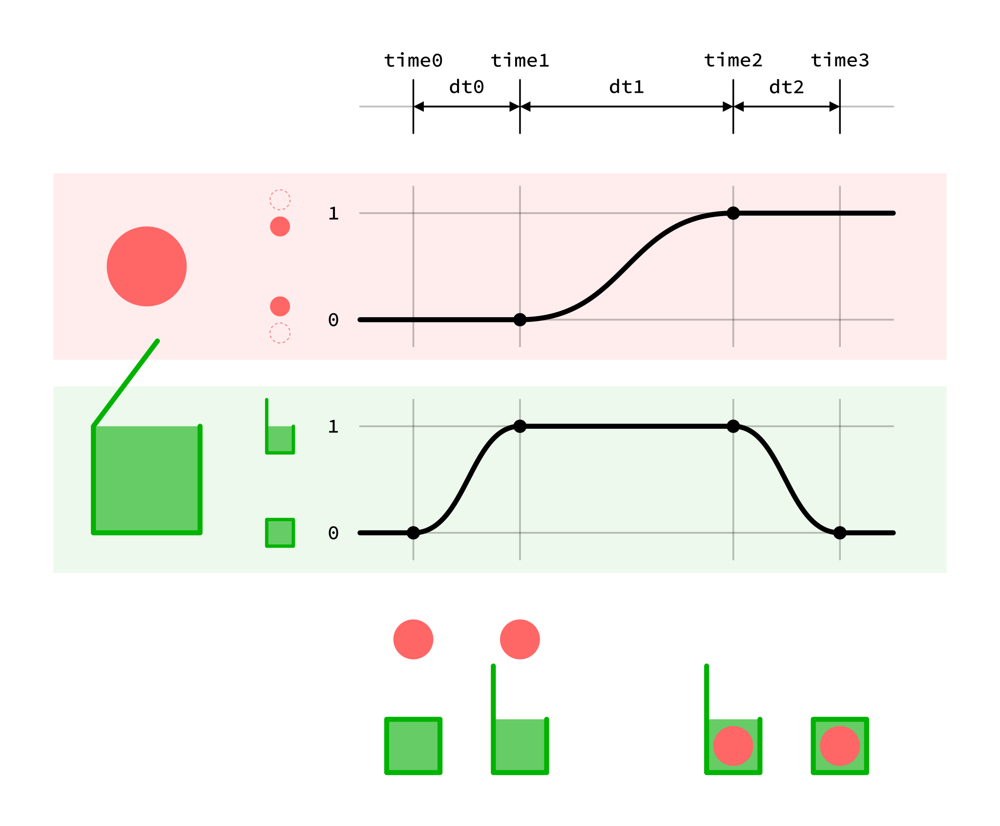

