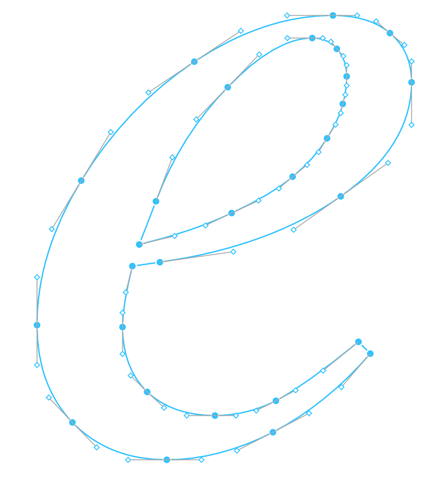
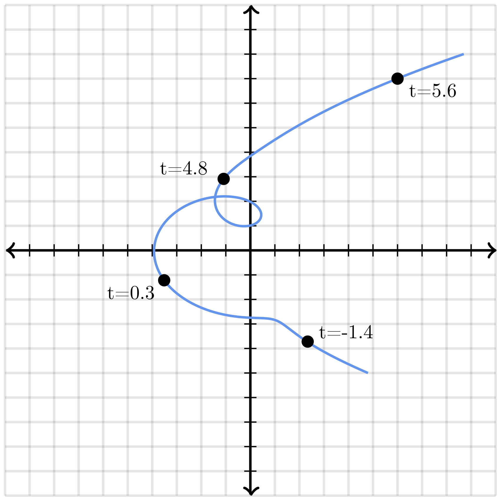
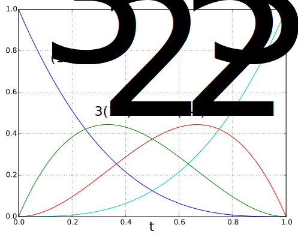
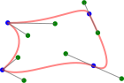

<!-- _backgroundColor: #222 -->
<!-- _color:           #eee -->
.png)

Računarska grafika
# Bezjeove krive

---

# Bezjeove krive (Bézier curves)

🚗 Nazvane po Pjeru Bezjeu (Pierre Bézier) koji ih je koristio 1960-tih za dizajn Renoovih automobila.

🚙 Međutim, razvio ih je Pol de Kastelžo (Paul de Casteljau) nekoliko godina ranije, radeći za Citroen.

### Primene
- Grafički dizajn
- 3D modeliranje  
- Fontovi
- Putanje u animaciji
- Animacione krive

---

# Parametarska kriva

Funkcija $p(t)$
- Kontinualna
- $p : \mathbb{R} \rightarrow \mathbb{R}^2$

Ograničavamo se na
$t \in [0,1]$

Radi kraćeg zapisa:
$s = 1-t$.

---

## Linearna Bezjeova kriva

<!-- Staviti animaciju za prezentaciju, samo jedan frame za pdf slajdove -->

$B_{P_0P_1}(t) = sP_0 + tP_1$

Duž između tačaka $P_0$ i $P_1$.

---

## Kvadratna Bezjeova kriva

<!-- Staviti animaciju za prezentaciju, samo jedan frame za pdf slajdove -->

$B_{P_0P_1P_2}(t) = sB_{P_0P_1}(t) + tB_{P_1P_2}(t)$
$\phantom{B_{P_0P_1P_2}(t)} = s(sP_0 + tP_1) + t(sP_1 + tP_2)$
$\phantom{B_{P_0P_1P_2}(t)} = s^2P_0 + 2stP_1 + t^2P_2$

Deo parabole između tačaka $P_0$ i $P_2$.

💻 `Bezier2_Quadratic`

---

## Kubna Bezjeova kriva

<!-- Staviti animaciju za prezentaciju, samo jedan frame za pdf slajdove -->

$B_{P_0P_1P_2P_3}(t) = sB_{P_0P_1P_2}(t) + tB_{P_1P_2P_3}(t)$
$\phantom{B_{P_0P_1P_2P_3}(t)} = s(s^2P_0 + 2stP_1 + t^2P_2) + t(s^2P_1 + 2stP_2 + t^2P_3)$
$\phantom{B_{P_0P_1P_2P_3}(t)} = s^3P_0 + 3s^2tP_1 + 3st^2P_2 + t^3P_3$

💻 `Bezier3_Cubic`

---

<!-- Staviti animaciju za prezentaciju, samo jedan frame za pdf slajdove -->

## Bezjeova kriva $n$-tog reda

$B_{P_0}(t) = P_0$
$B_{P_0 \ldots P_n}(t) = sB_{P_0 \ldots P_{n-1}}(t) + tB_{P_1 \ldots P_n}(t)$
$B_{P_0 \ldots P_n} = \sum_{i=0}^n{ {n \choose i}s^{n-i}t^iP_i}$

### Osobine:

- Počinje u $P_0$ i završava se u $P_n$.
- $P_0P_1$ je tangenta na početak, a $P_{n-1}P_n$ na kraj krive.
- Prava linija akko su $P_0, \ldots, P_n$ kolinearne.
- Svaka Bezjeova kriva reda $n$ je takođe Bezjeova kriva reda $m$, za svako $m > n$.
- Neke jednostavne krive se ne mogu prikazati kao Bezjeove krive, npr. kružnica!

---

# Složene Bezjeove krive
_(polybezier)_

Kriva koja se sastoji od više Bezjeovih krivi, tako da je kraj jedne početak sledeće.

"Glatka" je (prvi izvod je kontinualan) ako je svaka krajnja tačka kolinearna sa njoj dve susedne kontrolne tačke.

<!--
I prvi i drugi izvod su kontinualani ako važi prethodno, uz to da su rastojanja do dve susedne kontrolne tačake jednake.
Ovo sam "proverio" računski, deluje ok.
-->

---

# Putanje (klasa View)

`beginPath()`
Započinje kreiranje nove putanje.

`moveTo(p)`
Postavlja trenutnu poziciju na p, bez dodavanja novih delova putanje.

`lineTo(p)`
Dodaje duž od trenutne pozicije ka p. Nova trenutna pozicija je p.

`quadraticCurveTo(c, p)`
Dodaje kvadratnu Bezjeovu krivu od trenutne pozicije do pozicije p, koristeći kontrolnu tačku c. Nova trenutna pozicija je p.

`bezierCurveTo(c1, c2, p)`
Dodaje kubnu Bezjeovu krivu od trenutne pozicije do pozicije p, koristeći kontrolne tačke c1 i c2. Nova trenutna pozicija je p.

---

# Putanje (klasa View)

`closePath()`
Zatvara putanju, dodavajući duž koja spaja trenutnu poziciju sa početnom pozicijom.

`stroke()`
Iscrtava liniju po aktivnoj putanji.

`fill()`
Ispunjava površinu oivičenu aktivnom putanjom.
