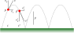
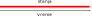
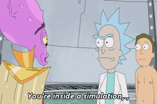

<style>
  img[alt~='center'] {
    display: block;
    margin-left: auto;
    margin-right: auto;
  }
</style>

<!-- _backgroundColor: #222 -->
<!-- _color:           #eee -->


Računarska grafika
# Simulacija

---

# Pojmovi

**_Sistem_**:
- Skup (matematičkih) objekata čije ponašanje simuliramo.

**_Model_**:
- Pravila po kojima se sistem menja, i početno stanje sistema.
  
**_Izgled_**:
- Karakteristike objekata iz sistema u datom trenutku.
- Objektivna stvarnost koju želimo izračunati simulacijom.

**_Stanje_**:
- Predstavlja **internu reprezentaciju** sistema unutar nekog načina simulacije.
- Definisano samo u kontekstu konkretnog načina simulacije.
- Odgovara izgledu nekog objekta u određenom vremenskom intervalu

---

# Primer procesa: Loptica skočica



💻 `BouncyBalls`

**Osnovne jednačine kretanja (ako nema odskakanja od poda):**

$t_Δ = t' - t$
$p' = p + v t_Δ + \frac{1}{2} g t_Δ^2$
$v' = v + g t_Δ$


---

# Analitičko rešenje



- Izgled sistema u proizvoljnom trenutku dobijamo preko formule.
- Cela simulacija je predstavljena jednim stanjem.

⚡ Veoma efikasno.
💯 Veoma precizna simulacija (do na model).
😭 Vrlo retko izvodljivo.

---


## Prikaz na primeru

**Brzina po $x$ je konstantna:**
$p'_x = p_x + v_x t_Δ \qquad v'_x = v_x$

**Premeštamo se na pod:**
$t_0 = t + {t_Δ}_0$
$p_y + v_y {t_Δ}_0 + \frac{1}{2} g {t_Δ}_0^2 = 0$
${t_Δ}_0 = \left(-v_y + \sqrt{v_y^2 - 2 g_y p_y}\right) / g_y$

**Odskakanje je periodično:**
$t_{period} = -2 {v_0}_y / g_y$
$t_Δ = (t'-t_0) \mod t_{period}$
$p'_y = {p_0}_y + {v_0}_y t_Δ + \frac{1}{2} g_y t_Δ^2$

💻 `Ball_Formula`

---

# Simulacija bazirana na događajima (_event-based_)


- Imamo događaje koji menjaju stanja.
- Unutar jednog stanja izgled računamo po jednostavnoj formuli.
- U petlji: Tražimo sledeći događaj. Menjamo stanja objekata koji učestvuju u njemu.

🚀 Efikasno.
🎯 Precizna simulacija.
🙂 Izgled u budućnosti možemo dobiti brzo (proporcionalno broju događaja).
🚫 Ne možemo se vraćati u vreme pre prethodnog događaja.
😢 Retko izvodljivo.

---
## Prikaz na primeru

Događaj: odskakanje od poda.
Stanje: period između dva odskakanja.
- Stanje predstavljeno trojkom $(t, p, v)$ označava da je loptica na početku tog stanja, u trenutku $t$, u tački $p$ koja je na podu $(p_y=0)$ i ima brzinu $v$ na gore $(v_y > 0)$.
- Za svaku lopticu računamo sledeći događaj, tj. kada će biti ponovo na podu.
- Realizujemo događaje redom po vremenu dešavanja.
- Realizacija događaja: Premeštamo lopticu u trenutak događaja (kada je ponovo na podu) i obrćemo menjamo $y$ komponentu brzine.


💻 `Ball_Events`

---

# Simulacija bazirana na otkucajima (_tick-based_)


- _Otkucaji_ (_tick_-ovi) se dešavaju često (stotinama ili hiljadama puta u sekundi), ali ravnomerno, sa jednakim vremenskim intervalom između otkucaja.
- Stanje se menja na svaki otkucaj.
- U svakom otkucaju ažuriramo stanja svih objekata.

🐢 Najmanje efikasno.
😐 Simulacija nije precizna (dolazi do odstupanja u odnosu na model).
🚫 Nije moguće vraćati se u nazad kroz vreme*.
😊 Uglavnom je jedini mogući način simulacije.

---

## Prikaz na primeru

- Stanje predstavljeno trojkom $(t, p, v)$ označava da je poslednji otkucaj bio u trenutku $t$, i tada je loptica imala položaj $p$ i brzinu $v$.

- $t_{tick}$ je dužina vremenskog intervala između dva otkucaja.

- Ažuriranje stanja se dešava prilikom svakog otkucaja, kada pomeramo vreme za $t_{tick}$ i računamo novi položaj i brzinu prema formuli za kretanje.


💻 `Ball_Ticks`

---

# Poređenje različitih metoda simulacije

|                     |Formula|Events|Ticks|
|---------------------|:---:|:---:|:---:|
|Brzina               |⚡|🚀|🐢|
|Preciznost           |💯|🎯|😐|
|Premotavanje u napred|😊|🙂|🤕|
|Premotavanje u nazad |😊|🚫|🚫|
|Izvodljivost         |😭|😢|😊|

---

# Real-time simulacija

Vreme unutar simulacije odgovara stvarnom vremenu.
- Omogućava ubacivanje događaja iz stvarnog sveta (npr. akcije igrača).
- U svakom frejmu prikazujemo izgled sistema dokle je stigla simulacija.

Kod event-based i tick-based simulacije, pre iscrtavanja moramo da "doguramo" aktuelno stanje da obuhvati trenutak iscrtavanja.


```java
  void updateTo(double time) {
    while (tNext <= time) {
      update();  // Prebacujemo stanje u sledeći tick.
    }
  }
```


---

## Najčešća početnička greška: Vezivanje tick-ova za frejmove. 🤦‍♂️

```java
  void drawFrame() {
    update();
  }
```
Nije dobro!
- Ako je $t_{tick}$ fiksno, onda brzina simulacije zavisi od frame-rate-a.
- Ako se za $t_{tick}$ koristi vreme proteklo između dva frejma, onda rezultat simulacije nije konzistentan.

> 🤯 Uvek treba da želimo determinističku simulaciju (da isti ulazni parametri uvek daju isti rezultat)! Kada želimo "nasumično" ponašanje, najbolje je koristiti generator pseudoslučajnih brojeva sa unapred zadatim seed-om.

---

<!-- _backgroundColor: #000 -->

