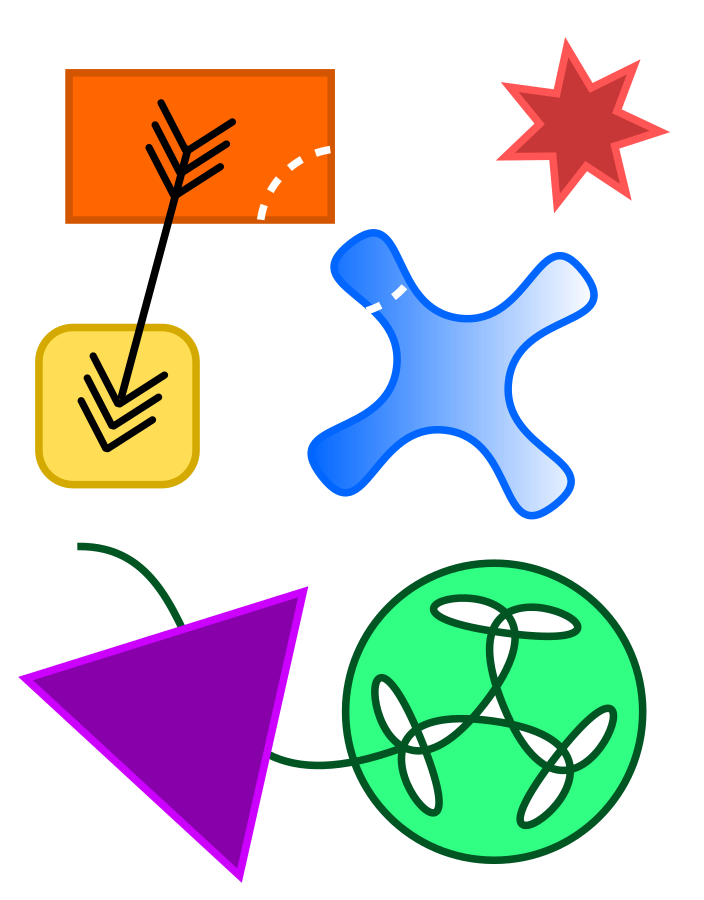
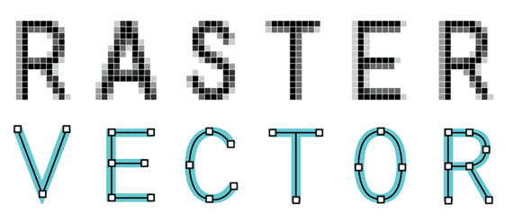
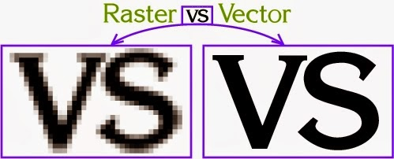
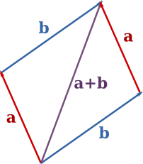
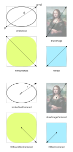
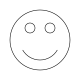
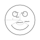

<!-- _backgroundColor: #222 -->
<!-- _color:           #eee -->

Računarska grafika
# Vektorska grafika

---

# Raster vs Vector

💻 `RasterVsVector`

#### Rasterska grafika
- Sliku čini matrica piksela
- Memorija ~ veličina matrice
- Obrada kvari kvalitet
- Primene: fotografija

#### Vektorska grafika
- Sliku čine objekti opisani geometrijski
- Memorija ~ broj objekata
- Obrada očuvava kvalitet
- Primene: dizajn

---

# Klasa `Vector`

Immutable klasa koja predstavlja 2D vektor

|||
|-|-|
|`new Vector(x, y)`| Kreira vektor (x, y) |
|`Vector.ZERO`| Vektor (0, 0) |
|`inverse()`| Inverzni vektor |
|`add(o)`| Sabira sa vektorom o |
|`sub(o)`| Oduzima vektor o |
|`mul(k)`| Skalira faktorom k |
|`norm()`| Norma (dužina) |

---

# Klasa `Vector`

|||
|-|-|
|`Vector.polar(r, phi)`| Kreira vektor sa polarnim koordinatama (r, phi) |
|`angle()`| Ugao između x-ose i vektora
|`rotate(phi)`| Rotira za ugao phi |
|`dot(o)`| Skalarni proizvod |
|`cross(o)`| Vektorski proizvod |
|`perp()`| Normalni vektor (u pozitivnom smeru) |
|...||

---

# Klasa `View`

- Skup metoda za crtanje
- Koordinatni sistem:
  - (0, 0) je u centru, x raste na desno, y raste na gore, 1 = 1 piksel
  	- Možete promeniti kako želite korišćenjem transformacija
  - Uglovi se mere u okretima (turns)
  	- 1 okret = 360° = 2π
  	- Meri se od pozitivnog dela x-ose u pozitivnom smeru (suprotno od kazaljke na satu)

---

# Klasa `View` - Crtanje oblika

- Dva tipa metoda za crtanje oblika:
  - `stroke...` - crtaju obod oblika.
  - `fill...` - ispunjavaju oblik.
- Oblik se crta unutar _axis-aligned_ pravougaonika zadatog u parametrima:
  - `...(Vector p, Vector d)`
  	- Jedno teme u `p`, suprotno teme u `p`+`d`
  - `...Centered(Vector c, Vector r)`
  	- Centar u `c`, radijus-vektor `r`.
- Stanje: {stroke boja, fill boja, debljina linije, transformacija, ...}

---

# 💻 `SmileyFace`

---

# 💻 `SmileyFace`

