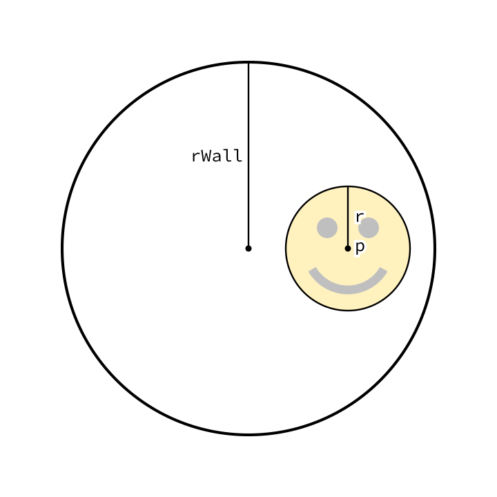
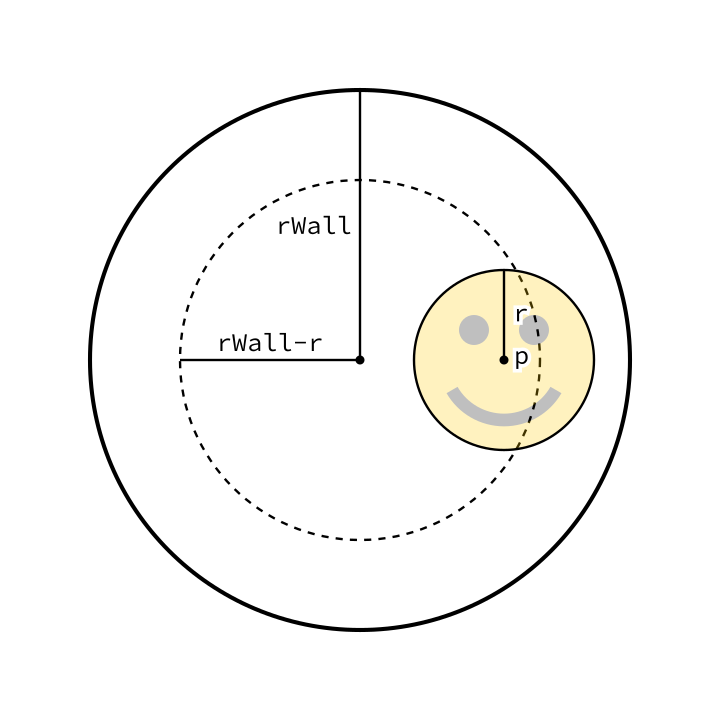
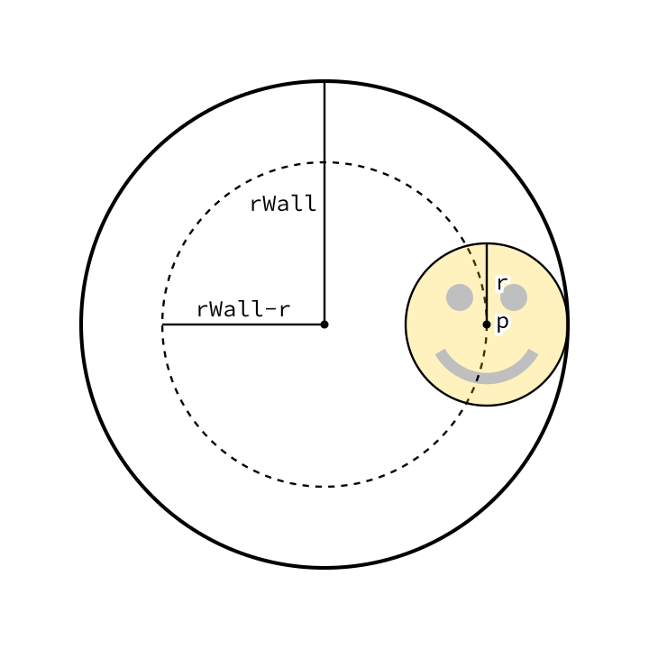
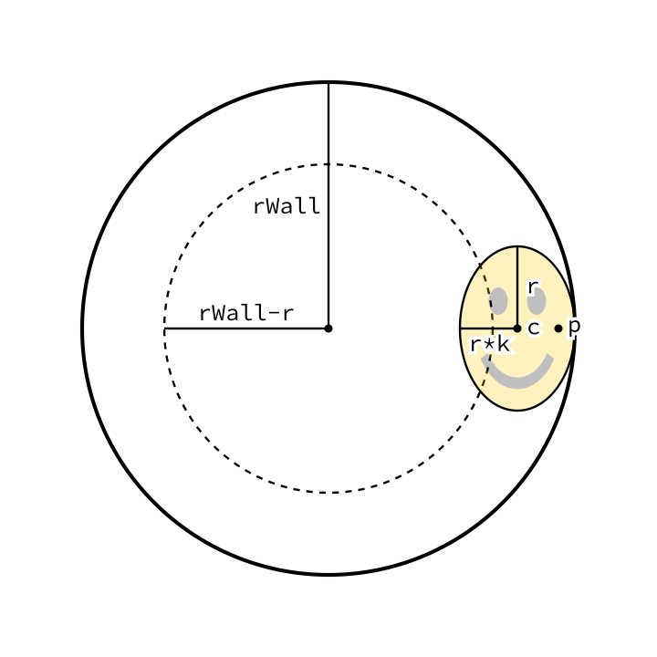
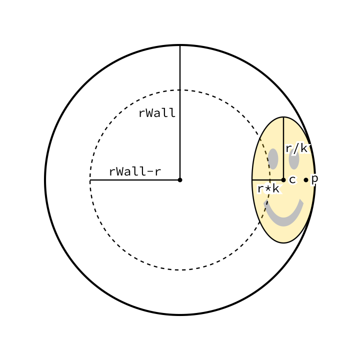
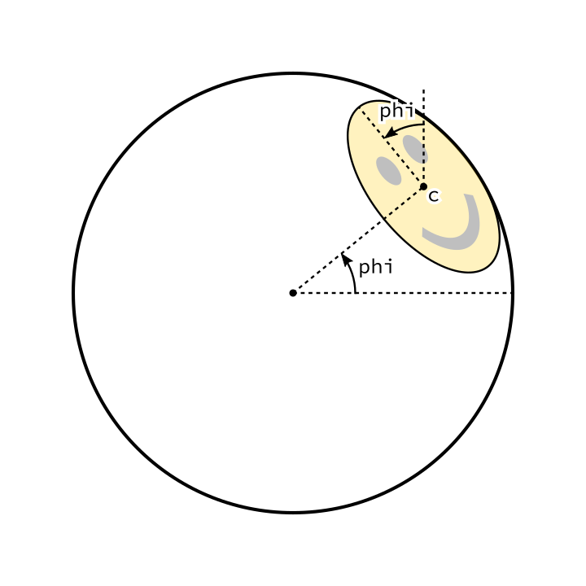

<style>
	img[alt~='center'] {
		display: block;
		margin-left: auto;
		margin-right: auto;
	}
	section {
		padding-top: 30px;
		padding-bottom: 30px;
		display: flex;
	}
	section ul li,
	section ol li {
		margin-top: 0.1em;   /* or 0 */
		margin-bottom: 0.1em;
	}
</style>
<!-- _backgroundColor: #222 -->
<!-- _color:           #eee -->


Računarska grafika
# Transformacije

---

# Transformacije

**Transformacije:** funkcije nad vektorima
(ali ih možemo zamišljati i nad celim objektima ili celim prostorom)

**Primeri primene:**
- Iscrtavanje definisanog objekta na drugom mestu i uz modifikacije.
- Premeštanje kamere kojom se "snima" scena.

**Afine transformacije:** transformacije koje čuvaju paralelnost pravih.
- To su: translacija, rotacija, skaliranje, osna simetrija, iskošavanje, projekcija (i bilo koja kombinacija prethodnih).
- Predstavljaju se matricama. Rezultat primene transformacije se dobija množenjem matrice i vektora.

> 🍬 [Matematika afinih transformacija](
https://people.dmi.uns.ac.rs/~marko.savic/teaching/rg1/resources/transformations.pdf)
(Linearne transformacije, afine transformacije, homogene koordinate, 3D)

---

# Klasa `Transformation`

Immutable klasa koja predstavlja afinu transformaciju.

Kreiranje transformacija

|||
|-|-|
|`new Transformation()`| Identičko preslikavanje |
|`Transformation.scaling(c)`| Skaliranje c puta |
|`Transformation.scaling(cx, cy)`| Skaliranje cx puta po x osi i cy puta po y osi |
|`Transformation.translation(v)`| Translacija za vektor v |
|`Transformation.rotation(phi)`| Rotacija za ugao phi |
|`Transformation.shearing(kx, ky)`| Iskošavanje |

---

# Kombinovanje transformacija

Ako nad objektom koji predstavlja transformaciju pozovemo neki od sledećih metoda, onda dobijamo novu transformaciju koja predstavlja kombinaciju transformacija.

|||
|-|-|
|`scale(c)`| Skalira c puta |
|`scale(cx, cy)`| Skalira cx puta po x osi i cy puta po y osi |
|`translate(v)`| Translira za vektor v |
|`rotate(phi)`| Rotira za ugao phi |
|`shear(kx, ky)`| Iskošava |

Nadovezivanje dve proizvoljne transformacije:
`t1.then(t2)` (prvo radimo `t1`, pa `t2`).

Redosled izvršavanja transformacija je bitan!

---

## Primer

Rotaciju oko tačke `p` za ugao `phi` dobijamo kombinacijom:
1) Translacija koja dovodi tačku `p` u koordinatni početak.
2) Rotacija za ugao `phi`.
3) Translaciju koja vraća koordinatni početak u tačku `p`.

---

```java
  Transformation t = new Transformation()
      .translate(p.inverse())
      .rotate(phi)
      .translate(p)
      ;
```

💻 `Transformations`

---

## Primena transformacije na vektore i klasu `View`

- Primenom transformacije na vektor `v` dobijamo novi vektor.
  ```
  Vector u = t.applyTo(v)
  ```
- Klasa `View` ima aktivnu transformaciju koju koristi za iscrtavanje svih objekata.
  - `view.setTransformation(t)` postavlja aktivnu transformaciju na `t`.
  - `view.addTransformation(t)` dodaje transformaciju `t` na aktivnu transformaciju.
  - Najčešća upotreba:
    ```java
    view.stateStore();
    view.setTransformation(t);
    // iscrtaj nesto...
    view.stateRestore()
    ```

💻 `SquishyFace`

---

# 💻 `SquishyFace`



---

# 💻 `SquishyFace`



---

# 💻 `SquishyFace`



---

# 💻 `SquishyFace`



---

# 💻 `SquishyFace`



---

# 💻 `SquishyFace`


